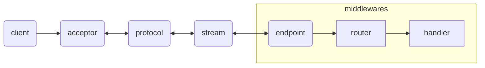
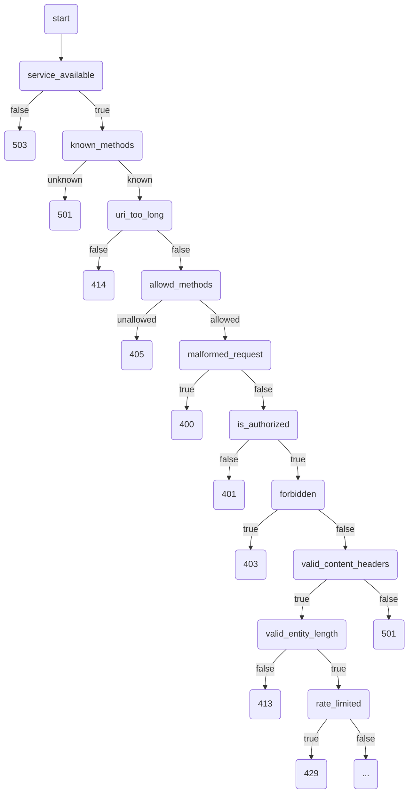
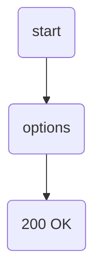
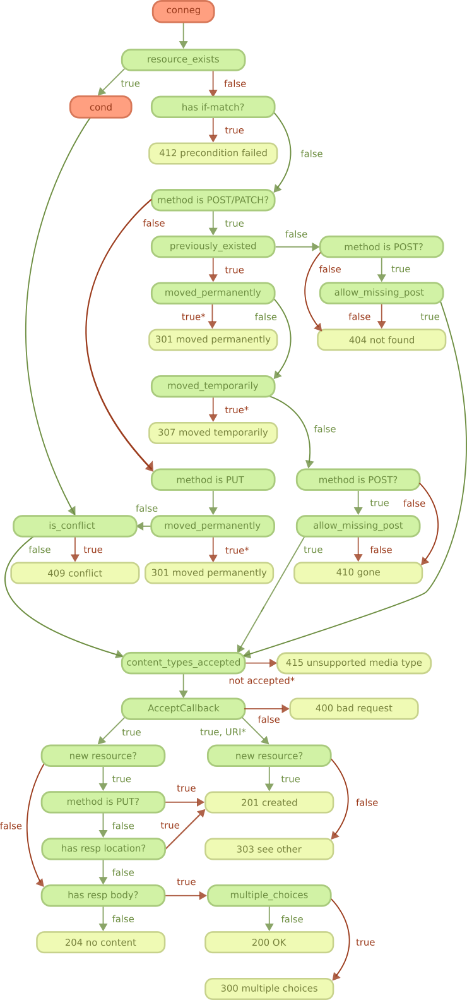
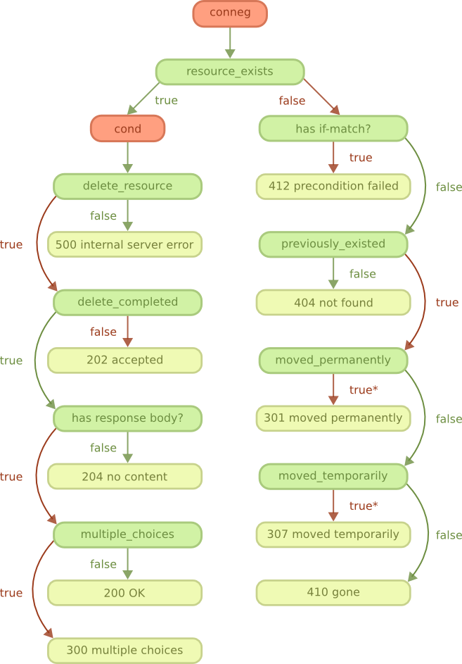
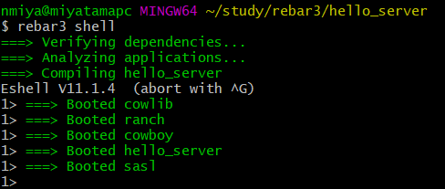
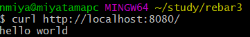
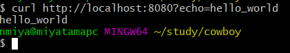
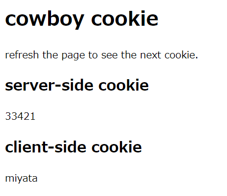
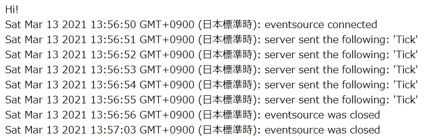

# Basics

this docs is learn result using [cowboy 2.8 Gettting started](https://ninenines.eu/docs/en/cowboy/2.8/guide/getting_started/).
start to create hello world project

```shell
mkdir -p ./code/hello_erlang
cd ./code/hello_erlang
curl -O https://erlang.mk/erlang.mk
make -f erlang.mk bootstrap bootstrap-rel
```

build and run

```shell
make run
```

you can see hello_erlang_sup process by typing `i().` command.

<image src="./docs/img/hello_erlang_001.png"/>

add cowboy reference to Makefile

```shell
cat << EOF > ./Makefile
PROJECT = hello_erlang
PROJECT_DESCRIPTION = New project
PROJECT_VERSION = 0.1.0

DEPS=cowboy
dep_cowboy_commit=2.8.0
DEPS_PLUGINS=cowboy

include erlang.mk
EOF
```

and run

```shell
make run
```

edit ./code/hello_erlang/src/hello_erlang_app.erl

<details><summary>./code/hello_erlang/src/hello_erlang_app.erl</summary>

```erlang
% replace start/2
start(_Type, _Args) ->
  Dispatch = cowboy_router:compile([
    {'_', [{"/", hello_handler, []}]}
  ]),
  {ok, _} = cowboy:start_clear(my_http_listener,
    [{port, 8080}],
    #{env => #{dispatch => Dispatch}}),
  hello_erlang_sup:start_link().
```

</details>

and run

```shell
make run
```

check error(not working)

```shell
# 500 error - module not found
curl http://localhost:8080/
# 404 error
curl http://localhost:8080/test
```

next, handling requests.generate handler template.

```shell
make new t=cowboy.http n=hello_handler
```

and write `init/2` function.

```erlang
-module(hello_handler).
-export([init/2]).

init(Req0, State) ->
	Req = cowboy_req:reply(
		200,
		#{<<"content-type">> => <<"text/planin">>},
		<<"hello erlang">>,
		Req0),
	[ok, Req, State].
```

and run

```shell
make run
```

check response(not working)

```shell
# not working
curl http://localhost:8080/
```

## Flow Diagram

 + cowboy create stream
 + cowboy using `cowboy_stream.h`



## listeners

about Ranch see [Ranch - Listener](https://ninenines.eu/docs/en/ranch/2.0/guide/listeners/)
need [examples](https://github.com/ninenines/cowboy/tree/master/examples).

```shell
git clone https://github.com/ninenines/cowboy.git
cp -r ./cowboy/examples/* ./code/
```

use ssl example is ssl_hello_world.

```erlang
start(_Type, _Args) ->
	Dispatch = cowboy_router:compile([
		{'_', [
			{"/", toppage_h, []}
		]}
	]),
	PrivDir = code:priv_dir(ssl_hello_world),
	{ok, _} = cowboy:start_tls(https, [
		{port, 8443},
		{cacertfile, PrivDir ++ "/ssl/cowboy-ca.crt"},
		{certfile, PrivDir ++ "/ssl/server.crt"},
		{keyfile, PrivDir ++ "/ssl/server.key"}
	], #{env => #{dispatch => Dispatch}}),
	ssl_hello_world_sup:start_link().
```

## Routing

[Guide - Routing](https://ninenines.eu/docs/en/cowboy/2.8/guide/routing/)

```erl
Dispatch = cowboy_router:compile(Routes).
```

 + Routes => [Host, Host, ...]
 + Host => {HostMatch, PathList} | {HostMatch, Constraints, PathList}
   + HostMatch
     + ex) "www.example1.org", "[www.]example1.org"
     + ex) ":user.example1.org" 
     + ex) "_" 
   + Constraints => [Constratint, Constraint, ...]
     + binding value for test
   + PathList => [Path, Path]
 + Constraint => {field, Constraints} 
 + Path => {PathMatch, Handler, InitialState} | {PathMatch, Constraints, Handler, InitialState}
   + PathMatch
     + ex) "/", "/path/to/api", "/path/to/api/[page/:number]", "/path/to/api/[page/[:number]]"
     + ex) "/path/to/api/[:chapter]/[:page]"
     + ex) "/path/to/api/:chapter/:page"
   + Constraints
     + binding value for test
   + Handler
     + behavitor cowboy_handler
   + InitialState

live update

```erlang
Dispatch = cowboy_router:compile(Routes),
cowboy:set_env(my_http_listener, dispatch, Dispatch).
```

## Constraints

[Guide - Constraints](https://ninenines.eu/docs/en/cowboy/2.8/guide/constraints/)

 + function applied to user input

```erlang
PositiveFun = fun
    (_, V) when V > 0 ->
        {ok, V};
    (_, _) ->
        {error, not_positive}
end,
{my_value, [int, PositiveFun]}.
```

## static

[Guide - Static files](https://ninenines.eu/docs/en/cowboy/2.8/guide/static_files/)

route example

```erlang
{"/", cowboy_static, {priv_file, my_app, "static/index.html"}}
% or {"/", cowboy_static, {priv_file, my_app, "static/index.html"}}
```

when all file matching use `[...]` pattern

```erlang
{"/assets/[...]", cowboy_static, {priv_dir, my_app, "static/assets"}}
```

using mimetype

```erlang
{"/assets/[...]", cowboy_static, {priv_dir, my_app, "static/assets",
    [{mimetypes, cow_mimetypes, web}]}}

{"/assets/[...]", cowboy_static, {priv_dir, my_app, "static/assets",
    [{mimetypes, cow_mimetypes, all}]}}

{"/assets/[...]", cowboy_static, {priv_dir, my_app, "static/assets",
    [{mimetypes, Module, Function}]}}

{"/", cowboy_static, {priv_file, my_app, "static/index.html",
    [{mimetypes, {<<"text">>, <<"html">>, []}}]}}
```

## req object

[Guide - The Req ob](https://ninenines.eu/docs/en/cowboy/2.8/guide/req/)

direct access

```erlang
init(Req0=#{method := <<"GET">>}, State) ->
    Req = cowboy_req:reply(200, #{
        <<"content-type">> => <<"text/plain">>
    }, <<"Hello world!">>, Req0),
    {ok, Req, State};
init(Req0, State) ->
    Req = cowboy_req:reply(405, #{
        <<"allow">> => <<"GET">>
    }, Req0),
    {ok, Req, State}.
```

 + Req
   + method
   + version
   + scheme 
   + host 
   + port 
   + path 
   + qs 

```erlang
Method = cowboy_req:method(Req).
Version = cowboy_req:version(Req).
Scheme = cowboy_req:scheme(Req),
Host = cowboy_req:host(Req),
Port = cowboy_req:port(Req),
Path = cowboy_req:path(Req).
Qs = cowboy_req:qs(Req).
URI = cowboy_req:uri(Req).
URI = cowboy_req:uri(Req, #{host => undefined}).
URI = cowboy_req:uri(Req, #{scheme => undefined}).
URI = cowboy_req:uri(Req, #{qs => undefined}).
URI = cowboy_req:uri(Req, #{host => <<"example.org">>}).
```

bind value

```erlang
Value = cowboy_req:binding(userid, Req).
Value = cowboy_req:binding(userid, Req, 42).
Bindings = cowboy_req:bindings(Req).
```

host info and path info

```erlang
HostInfo = cowboy_req:host_info(Req).
PathInfo = cowboy_req:path_info(Req).
```

query parameter

```erlang
QsVals = cowboy_req:parse_qs(Req),
{_, Lang} = lists:keyfind(<<"lang">>, 1, QsVals).
#{id := ID, lang := Lang} = cowboy_req:match_qs([id, lang], Req).
QsMap = cowboy_req:match_qs([{id, int}, {lang, nonempty}], Req).
#{lang := Lang} = cowboy_req:match_qs([{lang, [], <<"en-US">>}], Req).
```

headers

```erlang
HeaderVal = cowboy_req:header(<<"content-type">>, Req).
HeaderVal = cowboy_req:header(<<"content-type">>, Req, <<"text/plain">>).

#{headers := AllHeaders} = Req.
% or AllHeaders = cowboy_req:headers(Req).

% specified header
ParsedVal = cowboy_req:parse_header(<<"content-type">>, Req).
ParsedVal = cowboy_req:parse_header(<<"content-type">>, Req,
    {<<"text">>, <<"plain">>, []}).
```

peer 

```erlang
#{peer := {IP, Port}} = Req.
{IP, Port} = cowboy_req:peer(Req).
```

## reading request body

[Guide - Reading the request body](https://ninenines.eu/docs/en/cowboy/2.8/guide/req_body/)

use `cowboy_req:has_body(Req).`

```erlang
Length = cowboy_req:body_length(Req).
{ok, Data, Req} = cowboy_req:read_body(Req0).
{ok, Data, Req} = cowboy_req:read_body(Req0,
    #{length => 1000000, period => 5000}).
{ok, Data, Req} = cowboy_req:read_body(Req0, #{length => infinity}).
```

stream body use `more` atom.

```erlang
read_body_to_console(Req0) ->
    case cowboy_req:read_body(Req0) of
        {ok, Data, Req} ->
            io:format("~s", [Data]),
            Req;
        {more, Data, Req} ->
            io:format("~s", [Data]),
            read_body_to_console(Req)
    end.
```

url encoded body

```erlang
{ok, KeyValues, Req} = cowboy_req:read_urlencoded_body(Req0).
{ok, KeyValues, Req} = cowboy_req:read_urlencoded_body(Req0,
    #{length => 4096, period => 3000}).
```

## send a response

[Guide - Sending a response](https://ninenines.eu/docs/en/cowboy/2.8/guide/resp/)

use `cowboy_req:reply/2`.

```erlang
Req = cowboy_req:reply(200, Req0).
Req = cowboy_req:reply(303, #{
    <<"location">> => <<"https://ninenines.eu">>
}, Req0).
Req = cowboy_req:reply(200, #{
    <<"content-type">> => <<"text/plain">>
}, "Hello world!", Req0).
Title = "Hello world!",
Body = <<"Hats off!">>,
Req = cowboy_req:reply(200, #{
    <<"content-type">> => <<"text/html">>
}, ["<html><head><title>", Title, "</title></head>",
    "<body><p>", Body, "</p></body></html>"], Req0).
```

stream reply use `cowboy_req:stream_reply/2`.

```erlang
Req = cowboy_req:stream_reply(200, Req0),
cowboy_req:stream_body("Hello...", nofin, Req),
cowboy_req:stream_body("chunked...", nofin, Req),
cowboy_req:stream_body("world!!", fin, Req).
```

use `fin`

```erlang
Req = cowboy_req:stream_reply(200, #{
    <<"content-type">> => <<"text/html">>
}, Req0),

cowboy_req:stream_body("<html><head>Hello world!</head>", nofin, Req),
cowboy_req:stream_body("<body><p>Hats off!</p></body></html>", fin, Req).
```

use tailers

```erlang
Req = cowboy_req:stream_reply(200, #{
    <<"content-type">> => <<"text/html">>,
    <<"trailer">> => <<"expires, content-md5">>
}, Req0),

cowboy_req:stream_body("<html><head>Hello world!</head>", nofin, Req),
cowboy_req:stream_body("<body><p>Hats off!</p></body></html>", nofin, Req),

cowboy_req:stream_trailers(#{
    <<"expires">> => <<"Sun, 10 Dec 2017 19:13:47 GMT">>,
    <<"content-md5">> => <<"c6081d20ff41a42ce17048ed1c0345e2">>
}, Req).
```

resopnse header

```erlang
Req = cowboy_req:set_resp_header(<<"allow">>, "GET", Req0).
```

allow cookie

```erlang
cowboy_req:has_resp_header(<<"allow">>, Req).
```

remove header

```erlang
Req = cowboy_req:delete_resp_header(<<"allow">>, Req0).
```

override header

```erlang
Req = cowboy_req:reply(200, #{
    <<"server">> => <<"yaws">>
}, Req0).
```

preset resopnse body

```erlang
Req = cowboy_req:set_resp_body("Hello world!", Req0).
cowboy_req:has_resp_body(Req).
```

Sending File use `cowboy_req:reply/4`.

```erlang
% use {sendfile, Offset, Length, Filename}
Req = cowboy_req:reply(
  200, 
  #{<<"content-type">> => "image/png"}, 
  {sendfile, 0, 12345, "path/to/logo.png"}, 
  Req0).
```

informational response

```erlang
Req = cowby_req:inform(
  103,
  #{
    <<"link">> => <<"</style.css>; rel=preload; as=style, </script.js>; rel=preload; as=script">>
  },
  Req0).
```

push use `cowboy_req:push/3,4`.

```erlang
cowboy_req:push(
  "/sttic/style.css",
  #{
    <<"accept">> => <<"text/css">>
  },
  Req0),
Req = cowboy_req:reply(
  200,
  #{
    <<"content-type">> => <<"text/html">>
  },
  [
    "<html><head><title>my web page</title>",
    "<link rel='stylesheet' type='text/css' href='/static/style.css'></head>",
    "<body><p>welcome to erlang</p></body></html>"
  ],
  Req0).
```

specified host

```erlang
cowboy_req:push(
  "/sttic/style.css",
  #{
    <<"accept">> => <<"text/css">>
  },
  #{
    host => <<"cdn.example.com">>
  }
  Req),
```

## using cookies

[Guide - cookies](https://ninenines.eu/docs/en/cowboy/2.8/guide/cookies/)

setting cookies

```erlang
SessionID = generate_session_id(),
Req = cowboy_req:set_resp_cookie(<<"sessionid">>, SessionID, Req0).
% setting duration
Req = cowboy_req:set_resp_cookie(
  <<"sessionid">>, 
  SessionID, 
  Req0,
  #{max_age => 3600}).
% remove cookie, set max_age to 0
Req = cowboy_req:set_resp_cookie(
  <<"sessionid">>, 
  SessionID, 
  Req0,
  #{max_age => 0}).
```

specific domain and path

```erlang
Req = cowboy_req:set_resp_cookie(
  <<"inaccount">>,
  <<"1">>,
  Req0,
  #{
    domain => "my.example.org",
    path => "/account"
  }).
```

using secure channels

```erlang
SessionID = generate_session_id(),
Req = cowboy_req:set_resp_cookie(
  <<"sessionid">>,
  SessionID,
  Req0,
  #{secure => true}).
```

guard cookie access from client-side script

```erlang
SessionID = generate_session_id(),
Req = cowboy_req:set_resp_cookie(
  <<"sessionid">>,
  SessionID,
  Req0,
  #{http_only => true}).
```

reading cookie

```erlang
Cookies = cowboy_req:parse_cookies(Req),
{_, Lang} = lists:keyfind(<<"lang">>, 1, Cookies).
```

using constraing

```erlang
#{id := ID, lang := Lang} = cowboy_req:match_cookies([id, lang], Req).
Cookiemap = cowboy_req:match_cookies(
  [
    {id, int},
    {lang, nonempty}
  ], Req).
#{lang := Lang} = cowboy_req:match_cookies([{lang, [], <<"en-US">>}], Req).
```

## Multipart requests

[Guide - Multipart requests](https://ninenines.eu/docs/en/cowboy/2.8/guide/multipart/)


check for multipart message

```erlang
[<<"multipart">>, <<"form-data">>, _] = cowboy_req:parse_header(<<"content-type">>, Req).
```

reading multipart message

```erlang
multipart(Req0) ->
  case cowboy_req:read_part(Req0) of
    {ok, _Headers, Req1} ->
      {ok, _Body, Req} = cowboy_req:read_part_body(Req1),
      multipart(Req);
    {done, Req} ->
      Req
  end.
```

use `cow_multipart:form_data/1`

```erlang
multipart(Req0) ->
  case cowboy_req:read_part(Req0) of
    {ok, Headers, Req1} ->
      Req = case cow_multipart:form_data(Headers) of
        {data, _FieldName} ->
          {ok, _Body, Req2} = cowboy_req:read_part_body(Req1),
          Req2;
        {file, _FieldName, _Filename, _CType} ->
          stream_file(Req1)
      end,
      multipart(Req);
    {done, Req} ->
      Req
  end.
steram_file(Req0) ->
  case cowboy_req:read_part_body(Req0) of
    {ok, _LastBodyChunk, Req} ->
      Req;
    {more, _BodyChunk, Req} ->
      stream_file(Req)
  end.
```

change default for part headers

```erlang
cowboy_req:read_part(Req, #{length => 128000}).
```

and part bodies

```erlang
cowboy_req:read_part_body(Req, #{length => 1000000, period => 7000}).
```

skip unwanted part

```erlang
multipart(Req0) ->
  case cowboy_req:read_part(Req0) of
    {ok, _Headers, Req} ->
      multipart(Req);
    {done, Req} ->
      Req
  end.
```

## REST 

[Guide - REST principles](https://ninenines.eu/docs/en/cowboy/2.8/guide/rest_principles/)

 + Rest is ...
   + client-server archtecture
   + stateless
   + cacheable
   + uniform interface
   + layerd system
   + optionally provides code on demand

### handlers

initialize use `init/2`

```erlang
init(Req, State) ->
  {cowboy_rest, Req, State}.
```

 + methods
   + HEAD
   + GET
   + POST
   + PATCH
   + PUT
   + DELETE
   + OPTIONS

callback and default value

| Callback name | Default value |
| :----- | :----- |
| allowed_methods | `[<<"GET">>, <<"HEAD">>, <<"OPTIONS">>]` |
| allow_missing_post | `true` |
| charsets_provided | `skip` |
| content_types_accepted | `none` |
| content_types_provided | `[{{ <<"text">>, <<"html">>, '*'}, to_html}]` |
| delete_completed | `true` |
| delete_resource | `false` |
| expires | `undefined` |
| forbidden | `false` |
| generate_etag | `undefined` |
| is_authorized | `true` |
| is_conflict | `false` |
| known_methods | `[<<"GET">>, <<"HEAD">>, <<"POST">>, <<"PUT">>, <<"PATCH">>, <<"DELETE">>, <<"OPTIONS">>]` |
| languages_provided | `skip` |
| last_modified | `undefined` |
| malformed_request | `false` |
| moved_permanently | `false` |
| moved_temporarily | `false` |
| multiple_choices | `false` |
| options | `ok` |
| previously_existed | `false` |
| rate_limited | `false` |
| resource_exists | `true` |
| service_available | `true` |
| uri_too_long | `false` |
| valid_content_headers | `true` |
| valid_entity_length | `true` |
| variances | `[]` |

meta data

| Key | Details |
| :----- | :----- |
| media_type | The content-type negotiated for the response entity. |
| language | The language negotiated for the response entity. |
| charset | The charset negotiated for the response entity. |

response headers

| Header name | Details |
| :----- | :----- |
| content-language | Language used in the response body |
| content-type | Media type and charset of the response body |
| etag | Etag of the resource |
| expires | Expiration date of the resource |
| last-modified | Last modification date for the resource |
| location | Relative or absolute URI to the requested resource |
| vary | List of headers that may change the representation of the resource |

### flowchart

start



option method



negotiation `not provided is return 406`

 + content-type
 + languages
 + charset


GET and HEAD chart

 + resource exists and multiple choice then 300
 + resource not exists and if-match then 412
 + resource not exists and previously exists then 404
 + resource not exists and moved permanently then 301
 + resource not exists and moved temporally then 307
 + resource not exists and not moved temporally then 419

PUT, POST and PATCH chart is difficult

<

also DELETE chart too.



conditional request too


## WebSocket

[Guide - The Websocket protocol](https://ninenines.eu/docs/en/cowboy/2.8/guide/ws_protocol/)

### handlers

use `init/2` and `cowboy_websocket` constant.

```erlang
init(Req, State) ->
  {cowboy_websocket, Req, State}.
```

subprotocol STOMP and MQTT

```erlang
init(Req0, State) ->
  case cowboy_req:parsee_header(<<"sec-websocket-protocol">>, Req0) of
    undefined ->
      {cowboy_websocket, Req0, State};
    Subprotocols ->
      case lists:keymember(<<"mqtt">>, 1, Subprotocols) of
        true ->
          Req = cowboy_req:set_resp_header(
            <<"sec-websocket-protocol">>,
            <<"mqtt">>,
            Req0),
          {cowboy_websocket, Req, State};
        false ->
          Req = cowboy_req:reply(400, Req0),
          {ok, Req, Staet}
      end
  end.
```

init use `websocket_init/1`

```erlang
websocket_init(State) ->
  erlang:start_timer(10000, self(), <<"hello">>),
  {ok, State}.
% or
websocket_init(State) ->
  {[{text, <<"hello">>}], State}
```

receiving frame

```erlang
websocket_handle(Frame = {text, _}, State) ->
  {[Frame], State};
websocket_handle(_Frame, State) ->
  {ok, State}
```

and receiving erlang message

```erlang
websocket_info({log, Text}, State) ->
  {[{text, Text}], State};
websocket_info(_Info, state) ->
  {ok, State}.
```

sending frames use `websocket_` callback return value.

```erlang
websocket_info(_Info, State) -> 
  {ok, State}.
% or
websocket_info(_Info, State) -> 
  {[{text, <<"hello">>}], State}.
% or
websocket_info(_Info, State) -> 
  {
    [
      {text, "hello"},
      {text, <<"hello">>},
      {binary, <<0:8000>>}
    ], 
    State}.
```

keep connection

```erlang
init(Req, State) ->
  {cowboy_websocket,
  Req,
  State,
  #{idle_timeout => 30000}
  }.
```

limit frame size

```erlang
init(Req, State) ->
  {
    cowboy_websocket,
    Req,
    State,
    #{max_frame_size => 80000000}
  }.
```

saving memory use `hibarnate`

```erlang
websocket_init(State) ->
  {[], State, hibernate}.

websocket_handle(_Frame, State) ->
  {[], State, hibarnate}.

websocket_info(_Info, State) ->
  {
    [
      {text, <<"hello">>}
    ],j
    State,
   hibernate
  }.
```

Closing connection use `stop` and `close`

```erlang
websocket_info(_Info, State) ->
  {stop, State}.
websocket_info(_Info, State) ->
  {
    [
      {
        close,
        1000,
        <<"some-reason">>
      }
    ],
    State
  }.
```

# create project with rebar3

see 

 + [Erlang, Cowboy, Rebar3によるHello World HTTPサーバーのチュートリアル](https://cpplover.blogspot.com/2020/04/erlang-cowboy-rebar3hello-world-http.html).
 + [rebar3 Documentation](http://rebar3.org/docs/)

## create rebar3 command.

first setting, create `rebar3` command.

```shell
git clone https://github.com/erlang/rebar3.git
cd rebar3
./bootstrap
cp rebar3 /usr/bin/rebar3
```

## create project

create new project using `rebar3` command.

```shell
cd ./code
rebar3 new release hello_server
cd hello_server
```

created files in hello_server

| path | description |
| :----- | :----- |
| ./apps/hello_server/src/hello_server_app.erl | application |
| ./apps/hello_server/src/hello_server_sup.erl | supervisor |
| ./apps/hello_server/src/hello_server.app.src | application settings |
| rebar.config | build config |
| ./config/sys.config | system config |
| ./config/vm.args | vm config |
| .gitignore | git file |
| LICENSE | license file |
| README.md | readme |

## add cowboy

add cowboy dependency to rebar.confi

```erlang
{erl_opts, [debug_info]}.
{deps, [
  {cowboy, "2.8.0"}]}.
...
```

install cowboy

```shell
rebar3 upgrade
```

edit ./apps/hello_server/src/hello_server.app.src

```erlang
{application, hello_server,
 [{description, "An OTP application"},
  {vsn, "0.1.0"},
  {registered, []},
  {mod, {hello_server_app, []}},
  {applications,
   [kernel,
    stdlib,
    cowboy   % add cowboy
   ]},
  {env,[]},
  {modules, []},

  {licenses, ["Apache 2.0"]},
  {links, []}
 ]}.
```

## develop hello_server

edit ./apps/hello_server/src/hello_server_app.erl

```erlang
% start/2
start(_StartType, _StartArgs) ->
    Host = <<"localhost">>,
    Path = <<"/">>,
    Dispatch = cowboy_router:compile([
        {Host, [{Path, hello_handler, []}]}
    ]),
    {ok, _} = cowboy:start_clear(
        hello_listener,
        [{port, 8080}],
        #{env => #{dispatch => Dispatch}}
    ),
    hello_server_sup:start_link().
```

add hello_handler.erl

```shell
touch ./hello_server/apps/hello_server/src/hello_handler.erl
```

and edit

```erlang
-module(hello_handler).
-behavior(cowboy_handler).

-export([init/2]).

init(Req0, State) ->
  Req = cowboy_req:reply(
    200,
    #{<<"content-type">> => <<"text/plain">>},
    <<"hello world">>,
    Req0
  ),
  {ok, Req, State}.
```

## run hello_server application

run rebar3

```shell
rebar3 shell
```



and check response

```shell
curl http://localhost:8080
```



# echo get and echo post

## create new project and setting cowboy

```shell
cd ./code/
rebar3 new release echo_get_and_post
cd echo_get_and_post
```

add cowboy dependency

```erlang
% edit ./rebar.config
{deps, [
        {cowboy, "2.8.0"}
]}.
```

and install

```shell
rebar3 upgrade
```

add cowboy dependency to echo_get_and_post.app.src

```erlang
  {applications,
   [kernel,
    stdlib,
    cowboy
   ]},
```

## create get method

add web resource `toppage_h.erl`

<details><summary>./code/echo_get_and_post/apps/echo_get_and_post/src/toppage_h.erl</summary>

```erlang
-module(toppage_h).

-export([init/2]).

init(Req0, Opts) ->
  Method = cowboy_req:method(Req0),
  #{echo := Echo} = cowboy_req:match_qs([
    {echo, [], undefined}], 
    Req0),
  Req = echo(Method, Echo, Req0),
  {ok, Req, Opts}.

echo(<<"GET">>, undefined, Req) ->
  cowboy_req:reply(
    400,
    #{},
    <<"Missing echo parameter.">>,
    Req);
echo(<<"GET">>, Echo, Req) ->
  cowboy_req:reply(
    200,
    #{
      <<"content-type">> => <<"text/plain; charset=utf-8">>
    },
    Echo,
    Req);
echo(_, _, Req) ->
  cowboy_req:reply(405, Req).
```

</details>

set path "/"

<details><summary>./code/echo_get_and_post/apps/echo_get_and_post/src/echo_get_and_post_app.erl</summary>

```erlang
%%%-------------------------------------------------------------------
%% @doc echo_get_and_post public API
%% @end
%%%-------------------------------------------------------------------

-module(echo_get_and_post_app).

-behaviour(application).

-export([start/2, stop/1]).

start(_StartType, _StartArgs) ->
    Dispatch = cowboy_router:compile([
      {'_',
        [
          {"/", toppage_h, []}
        ]
      }
    ]),
    {ok, _} = cowboy:start_clear(
      http, 
      [
        {port, 8080}
      ],
      #{
        env => #{dispatch => Dispatch}
      }),
    echo_get_and_post_sup:start_link().

stop(_State) ->
    ok = cowboy:stop_listener(http).

%% internal functions
```

</details>

run application

```shell
rebar3 shell &
curl http://localhost:8080?echo=hello_world
```



## create post method

add `echo/3` to `toppage_h.erl`

<details><summary>./code/echo_get_and_post/apps/echo_get_and_post/src/toppage_h.erl</summary>

```erlang
-module(toppage_h).

-export([init/2]).

init(Req0, Opts) ->
  Method = cowboy_req:method(Req0),
  #{echo := Echo} = cowboy_req:match_qs([
    {echo, [], undefined}], 
    Req0),
  io:fwrite("query string echo ~p~n", [Echo]),
  Req = echo(Method, Echo, Req0),
  {ok, Req, Opts}.

echo(<<"POST">>, undefined, Req0) ->
  io:fwrite("echo/3 POST~n"),
  {ok, PostVals, Req} = cowboy_req:read_urlencoded_body(Req0),
  Echo = proplists:get_value(<<"echo">>, PostVals),
  echo(Echo, Req);
echo(<<"POST">>, _, Req) ->
  io:fwrite("echo/3 POST 405~n"),
  cowboy_req:reply(405, Req);
echo(<<"GET">>, undefined, Req) ->
  io:fwrite("echo/3 GET 400~n"),
  cowboy_req:reply(
    400,
    #{},
    <<"Missing echo parameter.">>,
    Req);
echo(<<"GET">>, Echo, Req) ->
  io:fwrite("echo/3 GET 200~n"),
  cowboy_req:reply(
    200,
    #{
      <<"content-type">> => <<"text/plain; charset=utf-8">>
    },
    Echo,
    Req);
echo(_, _, Req) ->
  io:fwrite("echo/3 any 405~n"),
  cowboy_req:reply(405, Req).
echo(undefined, Req) ->
  io:fwrite("echo/2 undefined~n"),
  cowboy_req:reply(
    400, 
    #{
      <<"content-type">> => <<"text/plain: charset=utf-8">>
    }, 
    <<"Missing echo parameter.">>, 
    Req);
echo(Echo, Req) ->
  io:fwrite("echo/2 any~n"),
  cowboy_req:reply(
    200, 
    #{
      <<"content-type">> => <<"text/plain; charset=utf-8">>
    },
    Echo,
    Req).
```

</details>

```shell
rebar3 shell
curl -XPOST -d "echo=hello_world" http://localhost:8080
# not multi part
# curl -XPOST -F "echo=hello_world" http://localhost:8080
```

# rest

## create new project and setting cowboy

```shell
cd ./code/
rebar3 new release rest
cd rest
```

add cowboy dependency

```erlang
% add cowboy dependency to ./rebar.config
{deps,[ 
  {cowboy, "2,8.0"}
]}.
```

install

```shell
rebar3 upgrade
```

add cowboy dependency to rest.app.src

```erlang
  {applications,
   [kernel,
    stdlib,
    cowboy
   ]},
```

## add hello_world

add route to rest_app.erl

<details><summary>./code/rest/apps/rest/src/rest_app.erl</summary>

```erlang
%%%-------------------------------------------------------------------
%% @doc rest public API
%% @end
%%%-------------------------------------------------------------------

-module(rest_app).

-behaviour(application).

-export([start/2, 
  stop/1]).

start(_StartType, _StartArgs) ->
  Dispatch = cowboy_router:compile([
    {'_', [
      {"/", toppage_h, []}
    ]}]),
    {ok, _} = cowboy:start_clear(http, [{port, 8080}], 
      #{
        env => #{dispatch => Dispatch}
      }),
    rest_sup:start_link().

stop(_State) ->
    ok = cowboy:stop_listener(http).

%% internal functions
```

</details>

add toppage_h

<details><summary>./code/rest/apps/rest/src/toppage_h.erl</summary>

```erlang
-module(toppage_h).

-export([init/2,
  allowed_methods/2,
  content_types_accepted/2,
  content_types_provided/2,
  delete_resource/2,
  delete_completed/2,
  resource_exists/2,
  hello_to_html/2,
  hello_to_json/2,
  hello_to_text/2]).

-define(DEBUG(S), io:fwrite("[DEBUG] toppage_h: " ++ S ++ "~n")).
-define(DEBUG(S, Args), io:fwrite("[DEBUG] toppage_h: " ++ S ++ "~n", Args)).

init(Req, Opts) ->
  ?DEBUG("init/2"),
  {cowboy_rest, Req, Opts}.

allowed_methods(Req, State) ->
  ?DEBUG("allowed_methods/2"),
  {
    [
      <<"GET">>,
      <<"POST">>,
      <<"PUT">>,
      <<"DELETE">>
    ],
    Req,
    State 
  }.

content_types_accepted(Req, State) ->
  ?DEBUG("content_types_accepted/2"),
  {
    [
      {{<<"text">>, <<"html">>, '*'}, hello_to_html},
      {{<<"application">>, <<"json">>, '*'}, hello_to_json},
      {{<<"text">>, <<"plain">>, '*'}, hello_to_text}
    ],
    Req,
   State 
  }.

content_types_provided(Req, State) ->
  ?DEBUG("content_types_provided/2"),
  {
    [
      {{<<"text">>, <<"html">>, '*'}, hello_to_html},
      {{<<"application">>, <<"json">>, '*'}, hello_to_json},
      {{<<"text">>, <<"plain">>, '*'}, hello_to_text}
    ],
    Req,
   State 
  }.

delete_resource(Req, State) ->
  ?DEBUG("delete_resource/2"),
  {true, Req, State}.

delete_completed(Req, State) ->
  ?DEBUG("delete_completed/2"),
  case cowboy_req:header(<<"content-type">>, Req) of
    <<"application/json">> ->delete_hello_json(Req, State);
    <<"text/html">> -> delete_hello_html(Req, State);
    <<"text/plain">> -> delete_hello_text(Req, State)
  end.

resource_exists(Req, State) ->
  ?DEBUG("resource_exists/2"),
  {true, Req, State}.

% curl -X GET -H 'Content-Type: application/json' -H 'Accept: application/json' http://localhost
% curl -X POST -H 'Content-Type: application/json' -H 'Accept: application/json' http://localhost
% curl -X PUT -H 'Content-Type: application/json' -H 'Accept: application/json' http://localhost
% curl -X DELETE -H 'Content-Type: application/json' -H 'Accept: application/json' http://localhost
hello_to_json(Req, State) ->
  ?DEBUG("hello_to_json/2"),
  case cowboy_req:method(Req) of
    <<"GET">> -> get_hello_json(Req, State);
    <<"PUT">> -> put_hello_json(Req, State);
    <<"POST">> -> post_hello_json(Req, State)
  end.


% curl -X GET -H 'Content-Type: text/html' -H 'Accept: text/html' http://localhost
% curl -X POST -H 'Content-Type: text/html' -H 'Accept: text/html' http://localhost
% curl -X PUT -H 'Content-Type: text/html' -H 'Accept: text/html' http://localhost
% curl -X DELETE -H 'Content-Type: text/html' -H 'Accept: text/html' http://localhost
hello_to_html(Req, State) ->
  ?DEBUG("hello_to_html/2"),
  case cowboy_req:method(Req) of
    <<"GET">> -> get_hello_html(Req, State);
    <<"PUT">> -> put_hello_html(Req, State);
    <<"POST">> -> post_hello_html(Req, State)
  end.

% curl -X GET -H 'Content-Type: text/plain' -H 'Accept: text/plain' http://localhost
% curl -X POST -H 'Content-Type: text/plain' -H 'Accept: text/plain' http://localhost
% curl -X PUT -H 'Content-Type: text/plain' -H 'Accept: text/plain' http://localhost
% curl -X DELETE -H 'Content-Type: text/plain' -H 'Accept: text/plain' http://localhost
hello_to_text(Req, State) ->
  ?DEBUG("hello_to_text/2"),
  case cowboy_req:method(Req) of
    <<"GET">> -> get_hello_text(Req, State);
    <<"PUT">> -> put_hello_text(Req, State);
    <<"POST">> -> post_hello_text(Req, State)
  end.

%%%%%%%%%%%%%%%%%%%%%%%%%%%%%%%%%%%%%%%%%%%%%%%%%%
% private function                               %
%%%%%%%%%%%%%%%%%%%%%%%%%%%%%%%%%%%%%%%%%%%%%%%%%%
get_hello_json(Req, State) ->
  ?DEBUG("get_hello_json/2"),
  {
    <<"{ \"method\": \"get\"}">>,
    Req,
    State
  }.
  
put_hello_json(Req, State) ->
  ?DEBUG("put_hello_json/2"),
  Resp = cowboy_req:set_resp_body(
    <<"{ \"method\": \"put\" }">>,
    Req
  ),
  {ok, Resp2} = cowboy_req:reply(
    200,
    Resp),
  {true, Resp2, State}.

post_hello_json(Req, State) ->
  ?DEBUG("post_hello_json/2"),
  Resp = cowboy_req:set_resp_body(
    <<"{ \"method\": \"post\" }">>,
    Req
  ),
  {ok, Resp2} = cowboy_req:reply(
    200,
    Resp),
  {true, Resp2, State}.

delete_hello_json(Req, State) ->
  ?DEBUG("post_hello_json/2"),
  Resp = cowboy_req:set_resp_body(
    <<"{ \"method\": \"delete\" }">>,
    Req
  ),
  {ok, Resp2} = cowboy_req:reply(
    200,
    Resp),
  {true, Resp2, State}.

get_hello_html(Req, State) ->
  ?DEBUG("get_hello_html/1"),
  {
    hello_html_body(<<"GET">>),
    Req,
    State
  }.

put_hello_html(Req, State) ->
  ?DEBUG("put_hello_html/1"),
  Resp = cowboy_req:set_resp_body(
    hello_html_body(<<"PUT">>),
    Req
  ),
  {ok, Resp2} = cowboy_req:reply(
    200,
    Resp),
  {true, Resp2, State}.

post_hello_html(Req, State) ->
  ?DEBUG("post_hello_html/1"),
  Resp = cowboy_req:set_resp_body(
    hello_html_body(<<"POST">>),
    Req
  ),
  {ok, Resp2} = cowboy_req:reply(
    200,
    Resp),
  {true, Resp2, State}.

delete_hello_html(Req, State) ->
  ?DEBUG("delete_hello_html/1"),
  Resp = cowboy_req:set_resp_body(
    hello_html_body(<<"DELETE">>),
    Req
  ),
  {ok, Resp2} = cowboy_req:reply(
    200,
    Resp),
  {true, Resp2, State}.

hello_html_body(Method) ->
  ?DEBUG("hello_html_body/1"),
  Body = <<"<html><head></head><body><h1>", Method/binary, "</h1></body></html>">>,
  Body.


get_hello_text(Req, State) ->
  ?DEBUG("get_hello_text/1"),
  {
    hello_text_body(<<"GET">>),
    Req,
    State
  }.

put_hello_text(Req, State) ->
  ?DEBUG("put_hello_text/1"),
  Resp = cowboy_req:set_resp_body(
    hello_text_body(<<"PUT">>),
    Req
  ),
  {ok, Resp2} = cowboy_req:reply(
    200,
    Resp),
  {true, Resp2, State}.

post_hello_text(Req, State) ->
  ?DEBUG("post_hello_text/1"),
  Resp = cowboy_req:set_resp_body(
    hello_text_body(<<"POST">>),
    Req
  ),
  {ok, Resp2} = cowboy_req:reply(
    200,
    Resp),
  {true, Resp2, State}.

delete_hello_text(Req, State) ->
  ?DEBUG("delete_hello_text/1"),
  Resp = cowboy_req:set_resp_body(
    hello_text_body(<<"DELETE">>),
    Req
  ),
  {ok, Resp2} = cowboy_req:reply(
    200,
    Resp),
  {true, Resp2, State}.

hello_text_body(Method) ->
  ?DEBUG("hello_text_body/1"),
  <<"this is ",Method/binary," method">>.
```

</details>

compile and run

```shell
rebar3 compile
rebar3 shell
```

and test

```shell
curl -X GET -H 'Content-Type: application/json' -H 'Accept: application/json' http://localhost
curl -X POST -H 'Content-Type: application/json' -H 'Accept: application/json' http://localhost
curl -X PUT -H 'Content-Type: application/json' -H 'Accept: application/json' http://localhost
curl -X DELETE -H 'Content-Type: application/json' -H 'Accept: application/json' http://localhost
curl -X GET -H 'Content-Type: text/html' -H 'Accept: text/html' http://localhost
curl -X POST -H 'Content-Type: text/html' -H 'Accept: text/html' http://localhost
curl -X PUT -H 'Content-Type: text/html' -H 'Accept: text/html' http://localhost
curl -X DELETE -H 'Content-Type: text/html' -H 'Accept: text/html' http://localhost
curl -X GET -H 'Content-Type: text/plain' -H 'Accept: text/plain' http://localhost
curl -X POST -H 'Content-Type: text/plain' -H 'Accept: text/plain' http://localhost
curl -X PUT -H 'Content-Type: text/plain' -H 'Accept: text/plain' http://localhost
curl -X DELETE -H 'Content-Type: text/plain' -H 'Accept: text/plain' http://localhost
```

## add Basic auth

add auth function to toppage_h

<details><summary>code/rest/apps/rest/src/toppage_h.erl</summary>

```erlang
% add basic auth function
is_authorized(Req, State) ->
  ?DEBUG("is_authorized/2"),
  case cowboy_req:parse_header(<<"authorization">>, Req) of
    {basic, User = <<"Alladin">>, <<"open sesame">>} ->
      ?DEBUG("is_authorized/2 - succeed"),
      {true, Req, User};
    _ ->
      ?DEBUG("is_authorized/2 - failure"),
      {{false, <<"Basic realm=\"cowboy\"">>}, Req, State}
  end.
```
</details>

build and run

```shell
rebar3 compile
rebar3 shell
```

test

```shell
# succeed basic auth
curl \
  -XGET \
  -i \
  -u 'Alladin:open sesame' \
  -H 'Accept: application/json' \
  -H 'Content-Type:application/json' \
  http://localhost:8080/

# failure basic auth
curl \
  -XGET \
  -i \
  -u 'Alladin:open sesame' \
  -u 'Jasmine:i am a wife' \
  -H 'Accept: application/json' \
  -H 'Content-Type:application/json' \
  http://localhost:8080/
```

## add paste bin

add route to `rest_app.erl`

<details><summary>code/rest/apps/rest/src/rest_app.erl</summary>

```erlang
%%%-------------------------------------------------------------------
%% @doc rest public API
%% @end
%%%-------------------------------------------------------------------

-module(rest_app).

-behaviour(application).

-export([start/2, 
  stop/1]).

start(_StartType, _StartArgs) ->
  Dispatch = cowboy_router:compile([
    {'_', [
      {"/", toppage_h, []},
      {"/pastebin/[:paste_id]", pastebin_h, []}
    ]}]),
    {ok, _} = cowboy:start_clear(http, [{port, 8080}], 
      #{
        env => #{dispatch => Dispatch}
      }),
    rest_sup:start_link().

stop(_State) ->
    ok = cowboy:stop_listener(http).

%% internal functions
```

</details>

add pastebin

<details><summary>code/rest/apps/rest/src/pastebin_h.erl</summary>

```erlang
-module(pastebin_h).

-export([init/2,
  allowed_methods/2,
  content_types_provided/2,
  content_types_accepted/2,
  resource_exists/2,
  create_paste/2,
  paste_html/2,
  paste_text/2
]).

-define(DEBUG(S), io:fwrite("[DEBUG] pastebin_h: " ++ S ++ "~n")).
-define(DEBUG(S, Args), io:fwrite("[DEBUG] pastebin_h: " ++ S ++ "~n", Args)).

init(Req, Opts) ->
  ?DEBUG("init/2"),
  {cowboy_rest, Req, Opts}.

allowed_methods(Req, State) ->
  ?DEBUG("allowed_methods/2"),
  {
    [
      <<"GET">>,
      <<"POST">>
    ],
    Req,
    State
  }.

content_types_provided(Req, State) ->
  ?DEBUG("content_types_provided/2"),
  {
    [
      {{<<"text">>, <<"plain">>, []}, paste_text},
      {{<<"text">>, <<"html">>, []}, paste_html}
    ],
    Req,
    State
  }.

content_types_accepted(Req, State) ->
  ?DEBUG("content_types_accespted/2"),
  {
    [
      {{<<"application">>, <<"x-www-form-urlencoded">>, '*'}, create_paste}
    ],
    Req,
    State
  }.

resource_exists(Req, _State) ->
  ?DEBUG("resource_exists/2"),
  case cowboy_req:binding(paste_id, Req) of
    undefined ->
      {true, Req, index};
    PasteID ->
      ?DEBUG("resource_exists/2 PasteID: ~p", [PasteID]),
      case valid_path(PasteID) and file_exists(PasteID) of
        true -> {true, Req, PasteID};
        false -> {false, Req, PasteID}
      end
  end.

create_paste(Req, State) ->
  ?DEBUG("create_paste/2"),
  PasteID = new_paste_id(),
  {ok, [{<<"paste">>, Paste}], Req2} = cowboy_req:read_urlencoded_body(Req),
  ?DEBUG("create_paste/2 PasteID: ~p, full path: ~p", [PasteID, full_path(PasteID)]),
  ?DEBUG("create_paste/2 Paste: ~p", [Paste]),

  ok = file:write_file(full_path(PasteID), Paste),
  case cowboy_req:method(Req2) of
    <<"POST">> ->
      {{true, <<$/, PasteID/binary>>}, Req2, State};
    _ ->
      {true, Req2, State}
  end.

paste_html(Req, index) ->
  ?DEBUG("paste_html/2"),
  {read_file("index.html"), Req, index};
paste_html(Req, Paste) ->
  ?DEBUG("paste_html/2"),
  #{lang := Lang} = cowboy_req:match_qs([{lang, [fun lang_constraint/2], plain}], Req),
  {format_html(Paste, Lang), Req, Paste}.

paste_text(Req, index) ->
  ?DEBUG("paste_text/2"),
  {read_file("index.txt"), Req, index};
paste_text(Req, Paste) ->
  ?DEBUG("paste_text/2"),
  #{lang := Lang} = cowboy_req:match_qs([{lang, [fun lang_constraint/2], plain}], Req),
  {format_text(Paste, Lang), Req, Paste}.


lang_constraint(forwart, Bin) ->
  case re:run(Bin, "^[a-z0-9_]+$", [{capture, none}]) of
    match -> {ok, Bin};
    nomatch -> {error, bad_lang}
  end;
lang_constraint(format_error, {bad_lang, _}) ->
  "Invalid lang parameter".

read_file(Name) ->
  {ok, Binary} = file:read_file(full_path(Name)),
  Binary.

full_path(Name) ->
  ?DEBUG("full_path/1 Name: ~p, priv_dir: ~p", [Name, code:priv_dir(rest)]),
  filename:join([code:priv_dir(rest), Name]).

file_exists(Name) ->
  ?DEBUG("file_exists/1 Name: ~p", [Name]),
  case file:read_file_info(full_path(Name)) of
    {ok, _Info} -> true;
    _ -> false
  end.

valid_path(<<>>) -> true;
valid_path(<<$., _T/binary>>) -> false;
valid_path(<<$/, _T/binary>>) -> false;
valid_path(<<_Char, T/binary>>) -> valid_path(T).

new_paste_id() ->
  Initial = rand:uniform(62) - 1,
  new_paste_id(<<Initial>>, 7).
new_paste_id(Bin, 0) ->
  Chars = <<"abcdefghijklmnopqrstuvwxyzABCDEFGHIJKLMNOPQRSTUVWXYZ1234567890">>,
  << <<(binary_part(Chars, B, 1))/binary>> || <<B>> <= Bin >>;
new_paste_id(Bin, Rem) ->
  Next = rand:uniform(62) - 1,
  new_paste_id(<<Bin/binary, Next>>, Rem - 1).

format_html(Paste, plain) ->
  Text = escape_html_chars(read_file(Paste)),
  <<"<!DOCTYPE html><html>"
  "<head><title>paste</title></head>"
  "<body><pre><code>", Text/binary, "</code></pre><body></html>\n">>;
format_html(Paste, Lang) ->
  highlight(full_path(Paste), Lang, "html").

format_text(Paste, plain) ->
  read_file(Paste);
format_text(Paste, Lang) ->
  highlight(full_path(Paste), Lang, "ansi").


highlight(Path, Lang, Type) ->
  Path1 = binary_to_list(Path),
  Lang1 = binary_to_list(Lang),
  os:cmd(["highlight --syntax=", Lang1,
  " --doc-title=paste ",
  " --out-format=", Type, 
  " --include-style ", Path1]).

escape_html_chars(Bin) ->
  << <<(escape_html_char(B))/binary>> || <<B>> <= Bin >>.

escape_html_char($<) -> <<"&lt;">>;
escape_html_char($>) -> <<"&gt;">>;
escape_html_char($&) -> <<"&amp;">>;
escape_html_char(C) -> <<C>>.

```

</details>

create file directory

```shell
mkdir ./code/rest/apps/rest/priv
```

run pastebin

```shell
rebar3 compile
rebar3 shell
```

and test

```shell
cat << EOF >> my_file
this is test
EOF
curl -XPOST -i --data-urlencode paste@my_file localhost:8080/pastebin
# result location is /dcQhbNrR
curl -XGET -i -H 'Content-Type:text/html' http://localhost:8080/pastebin/dcQhbNrR
```

# file server

## preparation

create project and file directory

```shell
cd ./code
rebar3 new release file_server
cd file_server
```

add cowboy and jsx dependency

```erlang
%edit ./rebar.config
{deps, [
        {cowboy, "2.8.0"},
        {jsx, "3.0.0"}
]}.
```

install

```shell
rebar3 upgrade
```

add cowboy dependency to ./file_server/apps/file_server/src/file_server.app.src

```erlang
 {applications,
   [kernel,
    stdlib,
    cowboy
   ]},
```

create file directory

```shell
mkdir ./code/fileserver/apps/fileserver/priv
# copy resource
cp -r ./resources/file_server/* ./code/file_server/apps/file_server/priv/
```

## add route

add route to file_server_app.erl

<details><summary>file_server_app.erl</summary>

```erlang
start(_StartType, _StartArgs) ->
  Dispatch = cowboy_router:compile(
    {
      '_',
      [
        {
          "/[...]",
          cowboy_static,
          {
            priv_dir,
            file_server,
            "",
            [
              {mimetypes, cow_mimetypes, all},
              {dir_handler, directory_h}
            ]
          }
        }
      ]
    }
  ),
  {ok, _} = cowboy:start_clear(
    http, 
    [{port, 8080}], 
    #{
      env => #{dispatch => Dispatch},
      middlewares => [
        cowboy_router, 
        directory_listener, 
        cowboy_handler]
    }
  ),
  file_server_sup:start_link().

stop(_State) ->
  ok = cowboy:stop_listener(http).
```

</details>

## add get method

add directory_h.erl

```shell
touch ./file_server/apps/file_server/src/directory_h.erl
```

<details><summary>./file_server/apps/file_server/src/directory_h.erl</summary>

```erlang
-module(directory_h).

-export([init/2,
  allowed_methods/2,
  resource_exists/2,
  content_types_provided/2,
  list_json/2,
  list_html/2]).

-define(DEBUG(S), io:fwrite("[DEBUG] directory_h: " ++ S ++ "~n")).
-define(DEBUG(S, Args), io:fwrite("[DEBUG] directory_h: " ++ S ++ "~n", Args)).

init(Req, Paths) ->
  ?DEBUG("init/2"),
  {cowboy_rest, Req, Paths}.

allowed_methods(Req, State) ->
  ?DEBUG("allowed_methods/2"),
  {
    [
      <<"GET">>
    ],
    Req,
    State
  }.

resource_exists(Req, {ReqPath, FilePath}) ->
  ?DEBUG("resource_exists/2"),
  case file:list_dir(FilePath) of
    {ok, Fs} -> {true, Req, {ReqPath, lists:sort(Fs)}};
    _Err -> {false, Req, {ReqPath, FilePath}}
  end.

content_types_provided(Req, State) ->
  ?DEBUG("content_types_provided/2"),
  {
    [
      {{<<"text">>, <<"html">>, []}, list_html},
      {{<<"application">>, <<"json">>, []}, list_json}
    ],
    Req, 
    State
  }.

list_json(Req, {Path, Fs}) ->
  ?DEBUG("list_json/2"),
  Files = [ <<(list_to_binary(F))/binary>> || F <- Fs],
  {jsx:encode(Files), Req, Path}.

list_html(Req, {Path, Fs}) ->
  ?DEBUG("list_html/2"),
  Body = [[links(Path, F) || F <- [".."|Fs] ]],
  HTML = [
    <<"<!DOCTYPE html><html><head><title>index</title></head><body>">>,
    Body,
    <<"</body></html>\n">>
  ],
  {HTML, Req, Path}.

links(<<>>, "..") ->
  ?DEBUG("links/2"),
  "<a href='/..'>..</a><br>\n";
links(Prefix, "..") ->
  ?DEBUG("links/2"),
  Tokens = string:tokens(binary_to_list(Prefix), "/"),
  Back = lists:join("/", lists:reverse(tl(lists:reverse(Tokens)))),
  ["<a href='/../", Back, "'>..</a><br>\n"];
links(<<>>, File) ->
  ?DEBUG("links/2"),
  ["<a href='/", File, "'>", File, "</a><br>\n"];
links(Prefix, File) ->
  ?DEBUG("links/2"),
  ["<a href='/", Prefix, File, "'>", File, "</a><br>\n"].
```

</details>

## add listener

add listener using cowboy_middleware

```shell
touch ./file_server/apps/file_server/src/directory_listener.erl
```

<details><summary>./file_server/apps/file_server/src/directory_listener.erl</summary>

```erlang
-module(directory_listener).
-behavior(cowboy_middleware).

-export([execute/2]).

-define(DEBUG(S), io:fwrite("[DEBUG] directory_listener: " ++ S ++ "~n")).
-define(DEBUG(S, Args), io:fwrite("[DEBUG] directory_listener: " ++ S ++ "~n", Args)).

execute(Req, Env=#{handler := cowboy_static}) ->
  ?DEBUG("execute/2"),
  redirect_directory(Req, Env);
execute(Req, Env) ->
  ?DEBUG("execute/2"),
  {ok, Req, Env}.

redirect_directory(Req, Env=#{handler_opts := {_, _, _, Extra}}) ->
  Path = cowboy_req:path_info(Req),
  Path1 = << <<S/binary, $/>> || S <- Path >>,
  {dir_handler, DirHandler} = lists:keyfind(dir_handler, 1, Extra),
  FullPath = resource_path(Path1),
  case valid_path(Path) and filelib:is_dir(FullPath) of
    true -> handle_directory(Req, Env, Path1, FullPath, DirHandler);
    false -> {ok, Req, Env}
  end.

handle_directory(Req, Env, Prefix, Path, DirHandler) ->
  {
    ok, 
    Req,
    Env#{
      handler => DirHandler, 
      handler_opts => {Prefix, Path}
    }
  }.

valid_path([]) -> true;
valid_path([<<"..">>|_T]) -> false;
valid_path([<<"/", _/binary>> | _T]) -> false;
valid_path([_H | Rest]) -> valid_path(Rest).

resource_path(Path) ->
  filename:join([code:priv_dir(file_server), Path]).
```

</details>

## test

```shell
# file list
curl -XGET -H 'Accept: text/html' -H 'Content-Type:text/html' http://localhost:8080/
curl -XGET -H 'Accept: application/json' -H 'Content-Type:application/json' http://localhost:8080/


# show file
curl -i http://localhost:8080/test.txt
curl -i http://localhost:8080/video.html
```

# upload

## preparation

create project and file directory

```shell
cd ./code
rebar3 new release upload
cd upload
```

add cowboy dependency

```erlang
%edit ./rebar.config
{deps, [
        {cowboy, "2.8.0"}
]}.
```

install

```shell
rebar3 upgrade
```

add cowboy dependency to ./upload/apps/upload/src/upload.app.src

```erlang
 {applications,
   [kernel,
    stdlib,
    cowboy
   ]},
```

create file directory

```shell
mkdir ./code/fileserver/apps/fileserver/priv
```

## add route

edit upload_app.erl.`./priv/index.html` is static file.

<details><summary>upload_app.erl</summary>

```erlang
%%%-------------------------------------------------------------------
%% @doc upload public API
%% @end
%%%-------------------------------------------------------------------

-module(upload_app).

-behaviour(application).

-export([start/2, stop/1]).

start(_StartType, _StartArgs) ->
    Dispatch = cowboy_router:compile([
      {
        '_',
        [
          {
            "/", 
            cowboy_static, 
            {
              priv_file, 
              upload, 
              "index.html"
            }
          },
          {
            "/upload",
            upload_h,
            []
          }
        ]
      }
    ]),
    {ok, _} = cowboy:start_clear(
      http,
      [{port, 8080}],
      #{
        env => #{dispatch => Dispatch}
      }),
    upload_sup:start_link().

stop(_State) ->
    ok = cowboy:stop_listener(http).

%% internal functions
```

</details>

## add upload method

add upload_h.erl

```shell
touch ./upload/apps/upload/src/upload_h.erl
```

<details><summary>upload_h.erl</summary>

```erlang
-module(upload_h).

-export([init/2]).

-define(DEBUG(S), io:fwrite("[DEBUG] upload_h: " ++ S ++ "~n")).
-define(DEBUG(S, Args), io:fwrite("[DEBUG] upload_h: " ++ S ++ "~n", Args)).

init(Req, Opts) ->
  ?DEBUG("init/2"),
  {ok, Headers, Req2} = cowboy_req:read_part(Req),
  {ok, Data, Req3} = cowboy_req:read_part_body(Req2),
  {file, <<"inputfile">>, Filename, ContentType} = cow_multipart:form_data(Headers),
  ?DEBUG("received file ~p of content-type ~p as follow: ~n~p~n~n", [Filename, ContentType, Data]),
  {ok, Req3, Opts}.
```

</details>

## add top page

```shell
touch ./upload/apps/upload/priv/index.html
```

<details><summary>upload_h.erl</summary>

```erlang
<html>
  <head>
    <meta http-equiv="Content-Type" content="text/html; charset=ISO-8859-1">
    <title></title>
  </head>
  <body>
    <form method="POST" enctype="multipart/form-data" action="/upload">
      <input type="file" name="inputfile"/>
      <input type="submit"/>
    </form>
  </body>
</html>
```

</details>


## test

open browser `http://localhost:8080/`

file upload

```shell
cat << EOF > dummy.txt
this is dummy
EOF
curl \
  -i \
  -XPOST \
  -F inputfile=@dummy.txt \
  http://localhost:8080/upload
```

# websocket

## preparation

create project and file directory

```shell
cd ./code
rebar3 new release websocket
cd websocket
```

add cowboy dependency

```erlang
%edit ./rebar.config
{deps, [
        {cowboy, "2.8.0"}
]}.
```

install

```shell
rebar3 upgrade
```

add cowboy dependency to ./websocket/apps/websocket/src/websocket.app.src

```erlang
 {applications,
   [kernel,
    stdlib,
    cowboy
   ]},
```

create file directory

```shell
mkdir ./code/websocket/apps/websocket/priv
```

## add route

edit websocket_app.erl

<details><summary>websocket_app.erl</summary>

```erlang
%%%-------------------------------------------------------------------
%% @doc websocket public API
%% @end
%%%-------------------------------------------------------------------

-module(websocket_app).

-behaviour(application).

-export([start/2, stop/1]).

start(_StartType, _StartArgs) ->
    Dispatch = cowboy_router:compile([
      {
        '_',
        [
          {"/", cowboy_static, {priv_file, websocket, "index.html"}},
          {"/websocket", ws_h, []},
          {"/static/[...]", cowboy_static, {{priv_file, websocket, "static"}}}
        ]
      }
    ]),
    {ok, _} = cowboy:start_clear(
      http, 
      [
        {port, 8080}
      ],
      #{
        env => #{dispatch => Dispatch}
      }),
    websocket_sup:start_link().

stop(_State) ->
    ok = cowboy:stop_listener(http).

%% internal functions
```

</details>

## add websocket handler

```shell
touch ./code/websocket/apps/websocket/src/ws_h.erl
```

<details><summary>websocket_app.erl</summary>

```erlang
-module(ws_h).

-export([
  init/2,
  websocket_init/1,
  websocket_handle/2,
  websocket_info/2]).

-define(DEBUG(S), io:fwrite("[DEBUG] ws_h: " ++ S ++ "~n")).
-define(DEBUG(S, Args), io:fwrite("[DEBUG] ws_h: " ++ S ++ "~n", Args)).

init(Req, Opts) ->
  ?DEBUG("init/2"),
  {cowboy_websocket, Req, Opts}.

websocket_init(State) -> 
  ?DEBUG("websocket_init/1"),
  erlang:start_timer(1000, self(), <<"hello">>),
  {[], State}.

websocket_handle({text, Msg}, State) ->
  ?DEBUG("websocket_handle/2 - Text"),
  {
    [
      {
        text,
        <<"That's what shel said!", Msg/binary >>
      }
    ]
    ,State
  };
websocket_handle(_Data, State) ->
  ?DEBUG("websocket_handle/2 - Data"),
  {[], State}.

websocket_info({timeout, _Ref, Msg}, State) ->
  ?DEBUG("websocket_info/2"),
  erlang:start_timer(1000, self(), <<"how you doin?">>),
  {[{text, Msg}], State};
websocket_info(_Info, State) ->
  ?DEBUG("websocket_info/2"),
  {[], State}.
```

</details>

## add top page

```shell
touch ./code/websocket/apps/websocket/priv/index.html
```

<details><summary>index.html</summary>

```erlang
<!DOCTYPE html>
<html>
  <head>
    <meta charset="utf-8"/>
    <title>client</title>
    <script type="text/javascript">

var websocket;
var server;
var message;
var connecting;
var connected;
var content;
var output;

// need onload
window.addEventListener('load', (event) => {
  server = document.getElementById("server");
  message = document.getElementById("message");
  connecting = document.getElementById("connecting");
  connected = document.getElementById("connected");
  content = document.getElementById("content");
  output = document.getElementById("output");

  server.value = "ws://" + window.location.host + "/websocket";
  connected.style.display = "none";
  content.style.display = "none";
});


function connect()
{
  wsHost = server.value;
  websocket = new WebSocket(wsHost);
  showScreen('<b>Connecting to: ' +  wsHost + '</b>');
  websocket.onopen = function(evt) { onOpen(evt) };
  websocket.onclose = function(evt) { onClose(evt) };
  websocket.onmessage = function(evt) { onMessage(evt) };
  websocket.onerror = function(evt) { onError(evt) };
};

function disconnect() {
  websocket.close();
};

function toggle_connection(){
  if (websocket && websocket.readyState == websocket.OPEN) {
    disconnect();
  } else {
    connect();
  };
};

function sendText() {
  if (websocket.readyState == websocket.OPEN) {
    var msg = message.value;
    websocket.send(msg);
    showScreen('sending: ' + msg);
  } else {
    showScreen('websocket is not connected');
  };
};

function onOpen(evt) {
  showScreen('<span style="color: green;">CONNECTED </span>');
  connecting.style.display = "none";
  connected.style.display = "";
  content.style.display = "";
};

function onClose(evt) {
  showScreen('<span style="color: red;">DISCONNECTED</span>');
};

function onMessage(evt) {
  showScreen('<span style="color: blue;">RESPONSE: ' + evt.data + '</span>');
};

function onError(evt) {
  showScreen('<span style="color: red;">ERROR: ' + evt.data + '</span>');
};

function showScreen(html) {
  var el = document.createElement("p");
  el.innerHTML = html;
  output.insertBefore(el, output.firstChild);
};

function clearScreen() {
  output.innerHTML = "";
};

  </script>
  </head>
  <body>
    <header>
      <h1>client</h1>
      <div id="status"></div>
    </header>
    <nav>
      <div id="connecting">
        <input type="text" id="server" value=""></input>
        <button type="button" onclick="toggle_connection();">connection</button>
      </div>
      <div id="connected">
        <input type="text" id="message" value=""></input>
        <button type="button" onclick="sendText();">send</button>
      </div>
    </nav>

    <main id="content">
      <button id="clear" onclick="clearScreen();">Clear Screen</button>
      <div id="output"></div>
    </main>
  </body>
</html>
```

</details>

## test

open browser `http://localhost:8080/`

 + tap connect button
 + input `hello server` to text box
 + tap send button


# cookie

## preparation

create project

```shlell
cd ./code
rebar3 new release cookie
cd cookie
```

add dependency cowboy and [erlydtl](https://hex.pm/packages/erlydtl).

```erlang
% vim ./rebar.config
{deps, [
  {cowboy, "2.8.0"},
  {erlydtl, "0.13.1"}
]}.
```

install

```shell
rebar3 upgrade
```

add cowboy dependency to cookie.app.src

```erlang
{application, cookie,
 [{description, "An OTP application"},
  {vsn, "0.1.0"},
  {registered, []},
  {mod, {cookie_app, []}},
  {applications,
   [kernel,
    stdlib,
    cowboy,  % add
    erlydtl  % add
   ]},
  {env,[]},
  {modules, []},

  {licenses, ["Apache 2.0"]},
  {links, []}
 ]}.
```

create template

```shell
mkdir ./code/cookie/apps/cookie/priv
touch ./code/cookie/apps/cookie/priv/template.dtl
```

edit toppage.dtl

<details><summary>toppage.dtl</summary>

```html
<!DOCTYPE html>
<html>
  <head>
    <meta charset="utf-8">
    <title>Cowboy Cookie</title>
    <script type="text/javascript">
    window.addEventListener('load', (event) => {
      document.cookie="client=miyata;test=testing";
    });
    </script>
  </head>
  <body>
    <h1>cowboy cookie</h1>
    <p>refresh the page to see the next cookie.</p>

    <h2>server-side cookie</h2>
    <p>{{ server }}</p>

    <h2>client-side cookie</h2>
    <p>{{ client }}</p>
  </body>
</html>
```

</details>

## add route

add route to cookie_app.erl

<details><summary>cookie_app.erl</summary>

```erlang
%%%-------------------------------------------------------------------
%% @doc cookie public API
%% @end
%%%-------------------------------------------------------------------

-module(cookie_app).

-behaviour(application).

-export([start/2, stop/1]).

-define(DEBUG(S), io:fwrite("[DEBUG] cookie_app: " ++ S ++ "~n")).

start(_StartType, _StartArgs) ->
  ?DEBUG("start/2"),
  TemplateFile = code:priv_dir(cookie) ++ "/template.dtl",
  erlydtl:compile_file(
    TemplateFile, 
    template_dtl,
    [{out_dir, false}]),
  Dispatch = cowboy_router:compile([
    {
      '_',
      [
        {'_', toppage_h, []}
      ]
    }]),
  {ok, _} = cowboy:start_clear(
    http, 
    [{port, 8080}],
    #{
      env => #{dispatch => Dispatch}
    }),
  cookie_sup:start_link().

stop(_State) ->
  ?DEBUG("stop/1"),
  ok = cowboy:stop_listener(http).

%% internal functions
```

</details>

## add toppage

add toppage handler

```shell
touch ./code/cookie/apps/cookie/src/toppage_h.erl
```

</details>

<details><summary>toppage_h.erl</summary>

```erlang
-module(toppage_h).

-export([init/2]).

-define(DEBUG(S), io:fwrite("[DEBUG]: toppage_h: " ++ S ++ "~n")).

init(Req0, Opts) ->
  ?DEBUG("init/2"),
  NewValue = integer_to_list(rand:uniform(100000)),
  Req1 = cowboy_req:set_resp_cookie(
    <<"server">>, 
    NewValue,
    Req0,
    #{path=><<"/">>}),
  #{client := ClientCookie, server := ServerCookie} = cowboy_req:match_cookies(
    [
      {client, [], <<>>},
      {server, [], <<>>}
    ],
    Req1),
  {ok, Body} = template_dtl:render([
    {client, ClientCookie},
    {server, ServerCookie}]),
  Req = cowboy_req:reply(
    200,
    #{ <<"content-type">> => <<"text/html">>},
    Body,
    Req1),
  {ok, Req, Opts}.
```

</details>

## test

build and run

```shell
cd ./code/cookie
rebar3 compile
rebar3 shell
```

open in browser `http://localhost:8080` and reload.



# ssl

## preparation

create project

```shell
cd ./code
rebar3 new release ssl_hello_world
cd ssl_hello_world
```

add dependency cowboy to `rebar.conf`

```erlang
{deps, [
  {cowboy, "2.8.0"}
]}.
```

add cowboy

```shell
rebar3 upgrade
```

add cowboy to `ssl_hello_world.app.src`

```erlang
{application, ssl_hello_world,
 [{description, "An OTP application"},
  {vsn, "0.1.0"},
  {registered, []},
  {mod, {ssl_hello_world_app, []}},
  {applications,
   [kernel,
    stdlib,
    cowboy
   ]},
  {env,[]},
  {modules, []},

  {licenses, ["Apache 2.0"]},
  {links, []}
 ]}.
```

create ssl files

```shell
mkdir -p ./code/ssl_hello_world/apps/ssl_hello_world/priv/ssl/CA/private
cd ./code/ssl_hello_world/apps/ssl_hello_world/priv/ssl/CA
mkdir -p certs
mkdir -p crl
mkdir -p newcerts
mkdir -p private
touch index.txt
touch openssl.cnf
echo 00 > crlnumber
```

<details><summary>openssl.cnf</summary>

```bash
HOME      = .
oid_section    = new_oids

[ new_oids ]
tsa_policy1 = 1.2.3.4.1
tsa_policy2 = 1.2.3.4.5.6
tsa_policy3 = 1.2.3.4.5.7

[ ca ]
default_ca  = CA_default

[ CA_default ]
dir    = /home/nmiya/study/cowboy/code/ssl_hello_world/apps/ssl_hello_world/priv/ssl/CA
certs    = $dir/certs
crl_dir    = $dir/crl
database  = $dir/index.txt
new_certs_dir  = $dir/newcerts
certificate  = $dir/cacert.pem
serial    = $dir/serial
crlnumber  = $dir/crlnumber
crl    = $dir/crl.pem
private_key  = $dir/private/cakey.pem
x509_extensions  = usr_cert
name_opt   = ca_default
cert_opt   = ca_default
default_days  = 365
default_crl_days= 30
default_md  = default
preserve  = no
policy    = policy_match

[ policy_match ]
countryName    = match
stateOrProvinceName  = match
organizationName  = match
organizationalUnitName  = optional
commonName    = supplied
emailAddress    = optional

[ policy_anything ]
countryName    = optional
stateOrProvinceName  = optional
localityName    = optional
organizationName  = optional
organizationalUnitName  = optional
commonName    = supplied
emailAddress    = optional

[ req ]
default_bits    = 2048
default_keyfile   = privkey.pem
distinguished_name  = req_distinguished_name
attributes    = req_attributes
x509_extensions  = v3_ca
string_mask = utf8only

[ req_distinguished_name ]
countryName      = Country Name (2 letter code)
countryName_default    = AU
countryName_min      = 2
countryName_max      = 2
stateOrProvinceName    = State or Province Name (full name)
stateOrProvinceName_default  = Some-State
localityName      = Locality Name (eg, city)
0.organizationName    = Organization Name (eg, company)
0.organizationName_default  = Internet Widgits Pty Ltd
organizationalUnitName    = Organizational Unit Name (eg, section)
commonName      = Common Name (e.g. server FQDN or YOUR name)
commonName_max      = 64
emailAddress      = Email Address
emailAddress_max    = 64

[ req_attributes ]
challengePassword    = A challenge password
challengePassword_min    = 4
challengePassword_max    = 20
unstructuredName    = An optional company name

[ usr_cert ]
basicConstraints=CA:FALSE
nsComment      = "OpenSSL Generated Certificate"
subjectKeyIdentifier=hash
authorityKeyIdentifier=keyid,issuer

[ v3_req ]
basicConstraints = CA:FALSE
keyUsage = nonRepudiation, digitalSignature, keyEncipherment

[ v3_ca ]
subjectKeyIdentifier=hash
authorityKeyIdentifier=keyid:always,issuer
basicConstraints = critical,CA:true

[ crl_ext ]
authorityKeyIdentifier=keyid:always

[ proxy_cert_ext ]
basicConstraints=CA:FALSE
nsComment      = "OpenSSL Generated Certificate"
subjectKeyIdentifier=hash
authorityKeyIdentifier=keyid,issuer
proxyCertInfo=critical,language:id-ppl-anyLanguage,pathlen:3,policy:foo

[ tsa ]
default_tsa = tsa_config1

[ tsa_config1 ]
dir    = ./demoCA
serial    = $dir/tsaserial
crypto_device  = builtin
signer_cert  = $dir/tsacert.pem

certs    = $dir/cacert.pem

signer_key  = $dir/private/tsakey.pem
signer_digest  = sha256
default_policy  = tsa_policy1

other_policies  = tsa_policy2, tsa_policy3
digests     = sha1, sha256, sha384, sha512
accuracy  = secs:1, millisecs:500, microsecs:100
clock_precision_digits  = 0
ordering    = yes
tsa_name    = yes
ess_cert_id_chain  = no
ess_cert_id_alg    = sha1
```

</details>

create ca keys

```shell
openssl req \
  -config ./openssl.cnf \
  -new \
  -keyout private/cakey.pem \
  -out csr.pem
openssl ca \
  -config ./openssl.cnf \
  -create_serial \
  -out cacert.pem \
  -days 10957 \
  -batch \
  -keyfile private/cakey.pem \
  -selfsign \
  -extensions v3_ca \
  -infiles csr.pem
```

create server cert

```shell
mkdir -p ./code/ssl_hello_world/apps/ssl_hello_world/priv/ssl/localhost
cd ./code/ssl_hello_world/apps/ssl_hello_world/priv/ssl/localhost
touch openssl.cnf
```

<details><summary>openssl.cnf</summary>

```shell
HOME = .
oid_section = new_oids

[ new_oids ]
tsa_policy1 = 1.2.3.4.1
tsa_policy2 = 1.2.3.4.5.6
tsa_policy3 = 1.2.3.4.5.7

[ ca ]
default_ca = CA_default

[ CA_default ]
dir = /home/nmiya/study/cowboy/code/ssl_hello_world/apps/ssl_hello_world/priv/ssl/localhost
certs = $dir/certs
crl_dir = $dir/crl
database = $dir/index.txt
new_certs_dir = $dir/newcerts
certificate = $dir/cacert.pem
serial = $dir/serial
crlnumber = $dir/crlnumber
crl = $dir/crl.pem
private_key = $dir/private/cakey.pem
x509_extensions = usr_cert
name_opt = ca_default
cert_opt = ca_default
default_days = 365
default_crl_days= 30
default_md = default
preserve = no
policy = policy_match

[ policy_match ]
countryName = match
stateOrProvinceName = match
organizationName = match
organizationalUnitName = optional
commonName = supplied
emailAddress = optional

[ policy_anything ]
countryName = optional
stateOrProvinceName = optional
localityName = optional
organizationName = optional
organizationalUnitName = optional
commonName = supplied
emailAddress = optional

[ req ]
default_bits = 2048
default_keyfile = privkey.pem
distinguished_name = req_distinguished_name
attributes = req_attributes
x509_extensions = v3_ca
string_mask = utf8only

[ req_distinguished_name ]
countryName = Country Name (2 letter code)
countryName_default = AU
countryName_min = 2
countryName_max = 2
stateOrProvinceName = State or Province Name (full name)
stateOrProvinceName_default = Some-State
localityName = Locality Name (eg, city)
0.organizationName = Organization Name (eg, company)
0.organizationName_default = Internet Widgits Pty Ltd
organizationalUnitName = Organizational Unit Name (eg, section)
commonName = Common Name (e.g. server FQDN or YOUR name)
commonName_max = 64
emailAddress = Email Address
emailAddress_max = 64

[ req_attributes ]
challengePassword = A challenge password
challengePassword_min = 4
challengePassword_max = 20
unstructuredName = An optional company name

[ usr_cert ]
authorityInfoAccess = caIssuers;URI:http://localhost/ca.crt
authorityKeyIdentifier=keyid,issuer
basicConstraints=CA:FALSE
certificatePolicies = 2.23.140.1.2.2
crlDistributionPoints = URI:http://localhost/ca.crl
extendedKeyUsage = serverAuth, clientAuth
keyUsage = critical, digitalSignature, keyEncipherment
subjectAltName=DNS:*.localhost.com
subjectKeyIdentifier=hash

[ v3_req ]
basicConstraints = CA:FALSE
keyUsage = nonRepudiation, digitalSignature, keyEncipherment

[ v3_ca ]
subjectKeyIdentifier=hash
authorityKeyIdentifier=keyid:always,issuer
basicConstraints = critical,CA:true

[ crl_ext ]
authorityKeyIdentifier=keyid:always

[ proxy_cert_ext ]
basicConstraints=CA:FALSE
nsComment = "OpenSSL Generated Certificate"
subjectKeyIdentifier=hash
authorityKeyIdentifier=keyid,issuer
proxyCertInfo=critical,language:id-ppl-anyLanguage,pathlen:3,policy:foo

[ tsa ]
default_tsa = tsa_config1

[ tsa_config1 ]
dir = /home/nmiya/study/cowboy/code/ssl_hello_world/apps/ssl_hello_world/priv/ssl/localhost
serial = $dir/tsaserial
crypto_device = builtin
signer_cert = $dir/tsacert.pem
certs = $dir/cacert.pem
signer_key = $dir/private/tsakey.pem
signer_digest = sha256
default_policy = tsa_policy1
other_policies = tsa_policy2, tsa_policy3
digests = sha1, sha256, sha384, sha512
accuracy = secs:1, millisecs:500, microsecs:100
clock_precision_digits = 0
ordering = yes
tsa_name = yes
ess_cert_id_chain = no
ess_cert_id_alg = sha1
```

</details>


create cert

```shell
openssl genrsa -aes256 2048 > localhost.pem
openssl rsa -in localhost.pem -out localhost.pem
openssl req \
  -config ./openssl.cnf \
  -new -key localhost.pem \
  -out localhost_csr.pem
```

sign

```shell
cd ./code/ssl_hello_world/apps/ssl_hello_world/priv/ssl/CA
openssl ca \
  -config ./openssl.cnf \
  -create_serial \
  -batch \
  -in ../localhost/localhost_csr.pem \
  -keyfile ./private/cakey.pem \
  -cert ./cacert.pem \
  -out ../localhost/localhost.crt \
  -days 397 \
  -policy policy_anything
openssl verify \
  -CAfile ./cacert.pem ../localhost/localhost.crt
```

## add route

<details><summary>ssl_hello_world_app.erl</summary>

```erlang
%%%-------------------------------------------------------------------
%% @doc ssl_hello_world public API
%% @end
%%%-------------------------------------------------------------------

-module(ssl_hello_world_app).

-behaviour(application).

-export([start/2, stop/1]).

-define(DEBUG(S), io:fwrite("[DEBUG] ssl_hello_world_app: " ++ S ++ "~n")).

start(_StartType, _StartArgs) ->
    ?DEBUG("start/2"),
    Dispatch = cowboy_router:compile([
      {
        '_',
        [
          {"/", toppage_h, []}
        ]
      }
    ]),
    PrivDir = code:priv_dir(ssl_hello_world),
    {ok, _} = cowboy:start_tls(
      https,
      [
        {port, 8443},
        {cacertfile, PrivDir ++ "/ssl/CA/cacert.pem" },
        {certfile, PrivDir ++ "/ssl/localhost/localhost.crt" },
        {keyfile, PrivDir ++ "/ssl/localhost/localhost.pem" }
      ],
      #{env => #{dispatch => Dispatch}}),
    ssl_hello_world_sup:start_link().

stop(_State) ->
    ok = cowboy:stop_listener(https).

%% internal functions
```

</details>


## add toppage

add toppage_h

```shell
touch ./ssl_hello_world/apps/ssl_hello_world/src/toppage_h.erl
```

<details><summary>toppage_h.erl</summary>

```erlang
-module(toppage_h).

-export([init/2]).

-define(DEBUG(S), io:fwrite("[DEBUG]: toppage_h: " ++ S ++ "~n")).

init(Req0, Opts) ->
  ?DEBUG("init/2"),
  Req = cowboy_req:reply(
    200,
    #{ <<"content-type">> => <<"text/plain">> },
    <<"Hello World!">>, 
    Req0),
  {ok, Req, Opts}.
```

</details>

## test

```shell
rebar3 compile
rebar3 shell
```

access localhost

```shell
# ssl connection error 
curl \
  --verbose \
  --cacert ./code/ssl_hello_world/apps/ssl_hello_world/priv/ssl/CA/cacert.pem \
  -i \
  https://localhost:8443
```

# chunked hello world

using stream example.

## preparation

create project chunked_hello_world.

```shell
cd code
rebar3 new release chunked_hello_world
cd chunked_hello_world
```

add cowboy dependency.

```erlang
% rebar.config
{erl_opts, [debug_info]}.
{deps, [
  {cowboy, "2.8.0"}
]}.
```

install

```shell
rebar3 upgrade
```

add cowboy dependency to `chunked_hello_world.app.src`

```erlang
{application, chunked_hello_world,
 [{description, "An OTP application"},
  {vsn, "0.1.0"},
  {registered, []},
  {mod, {chunked_hello_world_app, []}},
  {applications,
   [kernel,
    stdlib,
    cowboy,
   ]},
  {env,[]},
  {modules, []},

  {licenses, ["Apache 2.0"]},
  {links, []}
 ]}.
```

## add route

addd toppage route to `chunekd_hello_world_app.erl`.

<details> <summary>chunked_hello_world_app.erl</summary>

```erlang
%%%-------------------------------------------------------------------
%% @doc chunked_hello_world public API
%% @end
%%%-------------------------------------------------------------------

-module(chunked_hello_world_app).

-behaviour(application).

-export([start/2, stop/1]).

-define(DEBUG(S), io:fwrite("[DEBUG] chunked_hello_world_app: " ++ S ++ "~n")).

start(_StartType, _StartArgs) ->
    ?DEBUG("start/2"),
    Dispatch = cowboy_router:compile([
      {
        '_',
        [
          {"/", toppage_h, []}
        ]
      }]),
    {ok, _} = cowboy:start_clear(
      http,
      [
        {port, 8080}
      ]
      #{
        env => #{dispatch => Dispatch}
      })
    chunked_hello_world_sup:start_link().

stop(_State) ->
    ?DEBUG("stop/1"),
    ok = cowboy:stop_listener(http).

%% internal functions
```

</details>

## add toppage

create toppage

```shell
touch ./code/chunked_hello_wolrd/apps/chunked_hello_wolrd/src/toppage_h.erl
```

<details><summary>toppage_h.erl</summary>

```erlang
-module(toppage_h).

-export([init/2]).

-define(DEBUG(S), io:fwrite("[DEBUG] toppage_h: " ++ S ++ "~n")).

init(Req0, Opts) ->
  ?DEBUG("init/2"),
  Req = cowboy_req:stream_reply(200, Req0),
  cowboy_req:stream_body( "Hello\r\n", nofin, Req),
  timer:sleep(1000),
  cowboy_req:stream_body( "world\r\n", nofin, Req),
  timer:sleep(1000),
  cowboy_req:stream_body( "chunked\r\n", fin, Req),
  {ok, Req, Opts}.
```

</details>

## test

access localhost:8080

```shell
curl --verbose -i http://localhost:8080
```

# compress response

using cowboy stream headers example.

## preparation

create project.

```shll
cd code
rebar3 new release compress_response
cd compress_response
```

add cowboy dependency to `rebar3.config`.

```erlang
{erl_opts, [debug_info]}.
{deps, [
  {cowboy, "2.8.0"}
]}.
```

add cowboy dependency to `compress_response.app.src`

```erlang
{application, compress_response,
 [{description, "An OTP application"},
  {vsn, "0.1.0"},
  {registered, []},
  {mod, {compress_response_app, []}},
  {applications,
   [kernel,
    stdlib,
    cowboy
   ]},
  {env,[]},
  {modules, []},

  {licenses, ["Apache 2.0"]},
  {links, []}
 ]}.
```

install cowboy

```shell
rebar3 upgrade
```

## add route

add toppage route to `compress_response_app.erl`

<details> <summary>compress_resopnse_app.erl</summary>

```erlang
%%%-------------------------------------------------------------------
%% @doc compress_response public API
%% @end
%%%-------------------------------------------------------------------

-module(compress_response_app).

-behaviour(application).

-export([start/2, stop/1]).

-define(DEBUG(S), io:fwrite("[DEBUG] compress_response_app: " ++ S ++ "~n")).

start(_StartType, _StartArgs) ->
    ?DEBUG("start/2"),
    Dispatch = cowboy_router:compile([
      {
        '_',
        [
          {"/", toppage_h, []}
        ]
      }]),
    {ok, _} = cowboy:start_clear(
      http,
      [
        {port, 8080}
      ],
      #{
        env => #{dispatch => Dispatch},
        stream_headers => [
          cowboy_compress_h,
          cowboy_stream_h
        ]
      }
    ),
    compress_response_sup:start_link().

stop(_State) ->
    ?DEBUG("stop/1"),
    ok = cowboy:stop_listener(http).

%% internal functions
```

</details>

## add toppage

```shell
touch ./code/compress_response/apps/compress_response/src/toppage_h.erl
```

<details><summary>toppage_h.erl</summary>

```erlang
-module(toppage_h).

-export([init/2]).

-define(DEBUG(S), io:fwrite("[DEBUG] toppage_h: " ++ S ++ "~n")).

init(Req0, Opts) ->
  ?DEBUG("init/2"),
  BigBody = <<"this is big body.">>,
  Req = cowboy_req:reply(200, #{}, BigBody, Req0),
  {ok, Req, Opts}.
```

</details>

## test

compile and run

```shell
rebar3 compile
rebar3 shell
```

```shell
curl http://localhost:8080
```

# event source

## preparation

create project

```shell
cd code
rebar3 new release eventsource
cd eventsource
```

add cowboy dependency to `rebar3.config`

```erlang
{erl_opts, [debug_info]}.
{deps, [
  {cowboy, "2.8.0"}
]}.
```

add cowboy dependency to `eventsource.app.src`

```erlang
{application, eventsource,
 [{description, "An OTP application"},
  {vsn, "0.1.0"},
  {registered, []},
  {mod, {eventsource_app, []}},
  {applications,
   [kernel,
    stdlib,
    cowboy
   ]},
  {env,[]},
  {modules, []},

  {licenses, ["Apache 2.0"]},
  {links, []}
 ]}.
```

add cowboy library

```shell
rebar3 upgrade
```

## add route

add route to `eventsource_app.erl`

<details> <summary>eventsource_app.erl</summary>

```erlang
%%%-------------------------------------------------------------------
%% @doc eventsource public API
%% @end
%%%-------------------------------------------------------------------

-module(eventsource_app).

-behaviour(application).

-export([start/2, stop/1]).

-define(DEBUG(S), io:fwrite("[DEBUG] eventsource_app: " ++ S ++ "~n")).

start(_StartType, _StartArgs) ->
  ?DEBUG("start/2"),
  Dispatch = cowboy_router:compile([
    {'_',
      [
        {"/eventsource", eventsource_h, []},
        {"/", cowboy_static, {priv_file, eventsource, "index.html"}}
      ]}
  ]),
  {ok, _} = cowboy:start_clear(http, [{port, 8080}], #{
    env => #{dispatch => Dispatch}
  }),
  eventsource_sup:start_link().

stop(_State) ->
  ?DEBUG("stop/2"),
  ok = cowboy:stop_listener(http).

%% internal functions
```

</details>

## add toppage

add `index.html`

```shell
mkdir ./code/eventsource/apps/eventsource/priv
touch ./code/eventsource/apps/eventsource/priv/index.html
```

<details> <summary>index.html</summary>

```html
<!DOCTYPE html>
<html>
  <head>
    <script type="text/javascript">
      var statusDiv = null;
      window.addEventListener('load', (e) => {
        console.log('onLoad');
        statusDiv = document.getElementById('status');
        if(!!window.EventSource) {
          setupEventSource();
        } else {
          statusDiv.innerHTML = 
            "this browser does not support EventSource API";
        }
      })

      function setupEventSource() {
        console.log('setupEventSource()');
        var source = new EventSource('/eventsource');
        source.addEventListener('message', (event) => {
          console.log('on message');
          addStatus("server sent the following: '" + event.data + "'");
        }, false);

        source.addEventListener('open', (event) => {
          console.log('on open');
          addStatus("eventsource connected");
        }, false);

        source.addEventListener('error', (event) => {
          console.log('on error');
          if (event.eventPhase == EventSource.CLOSED) {
            addStatus("eventsource was closed");
          }
        }, false);
      }
      function addStatus(text) {
        var date = new Date();
        statusDiv.innerHTML = statusDiv.innerHTML + date + ": " + text + "<br/>";
      }
    </script>
  </head>
  <body>
    Hi!
    <div id="status"></div>
  </body>
</html>
```

</details>


## add eventsource surface

```shell
touch ./code/eventsource/apps/eventsource/src/eventsource_h.erl
```

<details><summary>eventsource_h.erl</summary>

```erlang
-module(eventsource_h).

-export([init/2,
  info/3]).

-define(DEBUG(S), io:fwrite("[DEBUG] eventsource_h: " ++ S ++ "~n")).

init(Req0, Opts) ->
  ?DEBUG("init/2"),
  Req = cowboy_req:stream_reply(
    200, 
    #{
      <<"content-type">> => <<"text/event-stream">>
    }, 
    Req0),
  erlang:send_after(1000, self(), {message, "Tick"}),
  {cowboy_loop, Req, Opts}.

info({message, Msg}, Req, State) -> 
  ?DEBUG("info/3"),
  cowboy_req:stream_events(
    #{
      id => id(),
      data => Msg
    }, 
    nofin, 
    Req),
  erlang:send_after(1000, self(), {message, "Tick"}),
  {ok, Req, State}.

id() ->
  ?DEBUG("id/0"),
  integer_to_list(erlang:unique_integer([positive, monotonic]), 16).
```

</details>

## test

compile run

```shell
rebar3 compile
rebar3 shell
```

open browser `http://localhost:8080`



# markdown

## preparation

create new project 

```shell
cd markdown
rebar3 new release markdown
cd markdown
```

add cowboy dependency to `rebar3.config`

```erlang
{erl_opts, [debug_info]}.
{deps, [
  {cowboy, "2.8.0"}
]}.
```

add cowboy dependency to `markdown.app.src`

```erlang
{application, markdown,
 [{description, "An OTP application"},
  {vsn, "0.1.0"},
  {registered, []},
  {mod, {markdown_app, []}},
  {applications,
   [kernel,
    stdlib,
    cowboy
   ]},
  {env,[]},
  {modules, []},

  {licenses, ["Apache 2.0"]},
  {links, []}
 ]}.
```

install cowboy library

```shell
rebar3 upgrade
```

## add route

add route to `markdown_app.erl`

<details><summary>markdown_app.erl</summary>

```erlang
%%%-------------------------------------------------------------------
%% @doc markdown public API
%% @end
%%%-------------------------------------------------------------------

-module(markdown_app).

-behaviour(application).

-export([start/2, stop/1]).

-define(DEBUG(S), io:fwrite("[DEBUG] markdown_app: " ++ S ++ "~n")).

start(_StartType, _StartArgs) ->
  ?DEBUG("start/2"),
  Dispatch = cowboy_router:compile([
    {
      '_',
      [
        {"/[...]", cowboy_static, {priv_dir, markdown, ""}}
      ]
    }
  ]),
  {ok, _} = cowboy:start_clear(
    http,
    [{port, 8080}],
    #{ 
      env => #{dispatch => Dispatch},
      middlewares => [cowboy_router, markdown_converter, cowboy_handler]
    }
  ),
  markdown_sup:start_link().

stop(_State) ->
  ?DEBUG("stop/1"),
  ok = cowboy:stop_listener(http).

%% internal functions
```

</details>

## add toppage

```shell
mkdir ./code/markdown/apps/markdown/priv
touch ./code/markdown/apps/markdown/priv/video.md
cp ./resources/markdown/* ./code/markdown/apps/markdown/priv/
```

video.md

```markdown
html5 video with markdown

<video controls>
<source src="small.ogv" type="video/ogg"/>
<source src="small.mp4" type="video/mp4"/>
</video>

video taken from [TechSlides](http://techslides.com/sample-webm-ogg-and-mp4-video-files-for-html5/)
```

## add markdown converter

```shell
touch ./code/markdown/apps/markdown/src/markdown_converter.erl
```

<details><summary>markdown_converter.erl</summary>

```erlang
-module(markdown_converter).
-behavior(cowboy_middleware).

-export([execute/2]).

-define(DEBUG(S), io:fwrite("[DEBUG] markdown_converter: " ++ S ++ "~n")).
-define(DEBUG(S, Args), io:fwrite("[DEBUG] markdown_converter: " ++ S ++ "~n", Args)).

execute(Req, Env) ->
  ?DEBUG("execute/2"),
  PathInfo = cowboy_req:path_info(Req),
  PathText = list_to_binary(PathInfo),
  case filename:extension(PathText) of 
    <<".html">> -> 
      ?DEBUG("execute/2 - is html"),
      maybe_generate_markdown(resource_path(PathText));
    _Ext -> 
      ?DEBUG("execute/2 - is not html"),
      ok
  end,
  {ok, Req, Env}.

maybe_generate_markdown(Path) ->
  ?DEBUG("maybe_generate_markdown/1"),
  ModifiedAt = filelib:last_modified(source_path(Path)),
  GeneratedAt = filelib:last_modified(Path),
  case ModifiedAt > GeneratedAt of
    true -> erlmarkdown:conv_file(source_path(Path), Path);
    false -> ok
  end.

resource_path(Path) ->
  ?DEBUG("resource_path/1"),
  PrivDir = code:priv_dir(markdown),
  filename:join([PrivDir, Path]).

source_path(Path) ->
  ?DEBUG("source_path/1"),
  << (filename:rootname(Path))/binary, ".md" >>.
```

</details>

```shell
touch ./code/markdown/apps/markdown/src/erlmarkdown.erl
```

<details><summary>erlmarkdown.erl</summary>

```erlang
-module(erlmarkdown).

-export([conv/1,
  conv_utf8/1,
  conv_file/2]).

-define(SPACE, 32).
-define(TAB,  9).
-define(LF,  10).
-define(CR,  13).
-define(NBSP, 160).
-define(AMP, $&, $a, $m, $p, $;).
-define(COPY, $&, $c, $o, $p, $y, $;).

-define(DEBUG(S), io:fwrite("[DEBUG] erlmarkdown: " ++ S ++ "~n")).

conv(String) ->
  ?DEBUG("conv/1"),
  Lex = lex(String),
  UntypedLines = make_lines(Lex),
  {TypedLines, Refs} = type_lines(UntypedLines),
  parse(TypedLines, Refs).

-spec conv_utf8(list()) -> list().
conv_utf8(Utf8) ->
  ?DEBUG("conv_utf8/1"),
  Str = xmerl_ucs:from_utf8(Utf8),
  Res = conv(Str),
  xmerl_ucs:to_utf8(Res).

conv_file(FileIn, FileOut) ->
  ?DEBUG("conv_file/2"),
  case file:open(FileIn, [read]) of
  {ok, Device} ->
    Input = get_all_lines(Device, []),
    Output = conv(Input),
    write(FileOut, Output);
  _ ->
    error
  end.

%%%%%%%%%%%%%%%%%%%%%%%%%%%%%%%%%%%%%%%%%%%%%%%%%%
% inner functions
%%%%%%%%%%%%%%%%%%%%%%%%%%%%%%%%%%%%%%%%%%%%%%%%%%
get_all_lines(Device, Accum) ->
  ?DEBUG("get_all_lines/2"),
  case io:get_line(Device, "") of
  eof ->
    file:close(Device),
    Accum;
  Line ->
    get_all_lines(Device, Accum ++ Line)
  end.

write(File, Text) ->
  _Return = filelib:ensure_dir(File),
  case file:open(File, [write]) of
  {ok, Id} ->
    io:fwrite(Id, "~s~n", [Text]),
    file:close(Id);
  _ ->
    error
  end.

parse(TypedLines, Refs) ->
  string:strip(p1(TypedLines, Refs, 0, []), both, $\n).

p1([], _R, _I, Acc) ->
  lists:flatten(lists:reverse(Acc));
p1([{tag, Tag} | T], R, I, Acc) ->
  case T of
    [] ->
      p1([], R, I, ["</p>", make_tag_str(Tag, R), "<p>" | Acc]);
    [{blank, _} | T2] ->
      p1(T2, R, I, [make_tag_str(Tag, R) | Acc]);
    _Other ->
      p1(T, R, I, [pad(I) ++ make_tag_str(Tag, R) | Acc])
  end;
p1([{blocktag, [{{{tag, open}, Type}, Tg}] = _Tag} | T], R, I, Acc) ->
  {Block, Rest} = grab_for_blockhtml(T, Type, []),
  Str = lists:flatten([Tg, "\n" | Block]),
  p1(Rest, R, I, [Str | Acc]);
p1([{Type, _} | T], R, I, Acc)
  when Type == blank orelse Type == linefeed ->
  Rest = grab_empties(T),
  p1(Rest, R, I, [pad(I) ++ "\n" | Acc]);
p1([{normal, P1}, {normal, P2} | T], R, I, Acc) ->
  p1([{normal, merge(P1, pad(I), P2)} | T], R, I, Acc);
p1([{normal, P}, {setext_h1, _} | T], R, I, Acc) ->
  p1(T, R, I,  [pad(I) ++ "<h1>" ++ make_string(snip(P), R)
          ++ "</h1>\n\n" | Acc]);
p1([{blockquote, P}, {setext_h1, _} | T], R, I, Acc) ->
  p1(T, R, I,  [pad(I) ++ "<h1>" ++ make_string(snip(P), R)
          ++ "</h1>\n\n" | Acc]);
p1([{{codeblock, P}, _}, {setext_h1, _} | T], R, I, Acc) ->
  p1(T, R, I,  [pad(I) ++ "<h1>" ++ make_string(snip(P), R)
          ++ "</h1>\n\n" | Acc]);
p1([{blockquote, P}, {h2_or_hr, _} | T], R, I, Acc) ->
  p1(T, R, I,  [pad(I) ++ "<h2>" ++ make_string(snip(P), R)
          ++ "</h2>\n\n" | Acc]);
p1([{{codeblock, P}, _}, {h2_or_hr, _} | T], R, I, Acc) ->
  p1(T, R, I,  [pad(I) ++ "<h2>" ++ make_string(snip(P), R)
          ++ "</h2>\n\n" | Acc]);
p1([{setext_h1, P} | T], R, I, Acc) ->
  p1([{normal, P} | T], R, I, Acc);
p1([{normal, P}, {h2_or_hr, _} | T], R, I, Acc) ->
  P2 = string:strip(make_string(snip(P), R), both, ?SPACE),
  p1(T, R, I, [pad(I) ++ "<h2>" ++ P2 ++ "</h2>\n\n" | Acc]);
p1([{blockquote, P1}, {blockquote, [_ | P2]} | T], R, I, Acc) ->
  p1([{blockquote, merge(P1, pad(I), [{{ws, sp}, " "} | P2])} | T], R, I, Acc);
p1([{blockquote, P1}, {normal, P2} | T], R, I, Acc) ->
  p1([{blockquote, merge(P1, pad(I + 1), P2)} | T], R, I, Acc);
p1([{blockquote, P} | T], R, I, Acc) ->
  [{{md, gt}, _} | T1] = P,
  T2 = string:strip(make_string(T1, R)),
  p1(T, R, I,
     ["\n<blockquote>\n" ++ pad(I + 1) ++ "<p>" ++ T2 ++ "</p>\n</blockquote>" | Acc]);
p1([{normal, P} | T], R, I, Acc) ->
  P2 = string:strip(make_string(snip(P), R), both, ?SPACE),
  p1(T, R, I, [pad(I) ++ "<p>" ++ P2 ++ "</p>\n" | Acc]);
p1([{{h1, P}, _} | T], R, I, Acc) ->
  NewP = string:strip(make_string(snip(P), R), right),
  p1(T, R, I,  [pad(I) ++ "<h1>" ++ NewP ++ "</h1>\n\n" | Acc]);
p1([{{h2, P}, _} | T], R, I, Acc) ->
  NewP = string:strip(make_string(snip(P), R), right),
  p1(T, R, I,  [pad(I) ++ "<h2>" ++ NewP ++ "</h2>\n\n" | Acc]);
p1([{{h3, P}, _} | T], R, I, Acc) ->
  NewP = string:strip(make_string(snip(P), R), right),
  p1(T, R, I,  [pad(I) ++ "<h3>" ++ NewP ++ "</h3>\n\n" | Acc]);
p1([{{h4, P}, _} | T], R, I, Acc) ->
  NewP = string:strip(make_string(snip(P), R), right),
  p1(T, R, I,  [pad(I) ++ "<h4>" ++ NewP ++ "</h4>\n\n" | Acc]);
p1([{{h5, P}, _} | T], R, I, Acc) ->
  NewP = string:strip(make_string(snip(P), R), right),
  p1(T, R, I,  [pad(I) ++ "<h5>" ++ NewP ++ "</h5>\n\n" | Acc]);
p1([{{h6, P}, _} | T], R, I, Acc) ->
  NewP = string:strip(make_string(snip(P), R), right),
  p1(T, R, I,  [pad(I) ++ "<h6>" ++ NewP ++ "</h6>\n\n" | Acc]);
p1([{{ul, P1}, S1}, {{normal, P2}, S2} | T], R, I , Acc) ->
  p1([{{ul, merge(P1, pad(I), P2)}, S1 ++ S2} | T], R, I, Acc);
p1([{{ul, P1}, S1}, {{codeblock, P2}, S2} | T], R, I , Acc) ->
  p1([{{ul, merge(P1, pad(I), P2)}, S1 ++ S2} | T], R, I, Acc);
p1([{{ul, _P}, _} | _T] = List, R, I, Acc) ->
  {Rest, NewAcc} = parse_list(ul, List, R, I, [], false),
  p1(Rest, R, I,  [pad(I) ++ "<ul>\n" ++ NewAcc
           ++ pad(I) ++ "</ul>\n" | Acc]);
p1([{{ol, P1}, S1}, {{normal, P2}, S2} | T], R, I , Acc) ->
  p1([{{ol, merge(P1, pad(I), P2)}, S1 ++ S2} | T], R, I, Acc);
p1([{{ol, P1}, S1}, {{codeblock, P2}, S2} | T], R, I , Acc) ->
  p1([{{ol, merge(P1, pad(I), P2)}, S1 ++ S2} | T], R, I, Acc);
p1([{{ol, _P}, _} | _T] = List, R, I, Acc) ->
  {Rest, NewAcc} = parse_list(ol, List, R, I, [], false),
  p1(Rest, R, I,  [pad(I) ++ "<ol>\n" ++ NewAcc
           ++ pad(I) ++ "</ol>\n" | Acc]);
p1([{{codeblock, P1}, S1}, {{codeblock, P2}, S2} | T], R, I, Acc) ->
  p1([{{codeblock, merge(P1, pad(I), P2)}, S1 ++ S2} | T], R, I, Acc);
p1([{{codeblock, P}, _} | T], R, I, Acc) ->
  Rest = grab_empties(T),
  p1(Rest, R, I,  ["<pre><code>" ++ make_string(snip(P), R)
           ++ "\n</code></pre>\n\n" | Acc]);
p1([{hr, _} | T], R, I, Acc) ->
  p1(T, R, I,  ["<hr />" | Acc]);
p1([{h2_or_hr, P1}, {normal, P2} | T], R, I, Acc) ->
  p1([{normal, lists:flatten([P1 | P2])} | T], R, I, Acc);
p1([{h2_or_hr, _} | T], R, I, Acc) ->
  p1(T, R, I,  ["<hr />" | Acc]);
p1([{inlineref, _P} | T], R, I, Acc) ->
  p1(T, R, I, Acc).
grab_for_blockhtml([], Type, Acc) ->
  {lists:reverse(["</" ++ Type ++ ">" | Acc]), []};
grab_for_blockhtml([{blocktag, [{{{tag, close}, Type}, Tg}]}
          | T], Type,  Acc) ->
  {lists:reverse([Tg | Acc]), T};
grab_for_blockhtml([{blocktag, [{{{tag, _}, GrabType}, Tg}]}
          | T], Type,  Acc) when GrabType =/= Type ->
  grab_for_blockhtml(T, Type, ["\n", Tg | Acc]);
grab_for_blockhtml([{tag, {{{tag, self_closing}, _Ty}, Tg}}
          | T], Type, Acc) ->
  grab_for_blockhtml(T, Type, [Tg | Acc]);
grab_for_blockhtml([H | T], Type, Acc) ->
  {_Type, Content} = H,
  Str = make_plain_string(Content),
  grab_for_blockhtml(T, Type, [Str | Acc]).
grab_empties([{linefeed, _} | T]) -> grab_empties(T);
grab_empties([{blank, _} | T])  -> grab_empties(T);
grab_empties(List)        -> List.
merge(P1, Pad, P2) ->
  NewP1 = make_br(P1),
  lists:flatten([NewP1, {string, Pad} | P2]).
make_br(List) -> make_br1(lists:reverse(List)).
make_br1([{{lf, _}, _},
      {{ws, comp}, _} | T]) -> lists:reverse([{tags, " <br />\n"} | T]);
make_br1([{{lf, _}, _},
      {{ws, tab}, _} | T])  -> lists:reverse([{tags, " <br />\n"} | T]);
make_br1(List)          -> lists:reverse(List).
pad(N) ->
  pad1(N, []).
pad1(0, Acc) ->
  Acc;
pad1(N, Acc)
  when N > 0 ->
  pad1(N - 1, ["  " | Acc]).
parse_list(_Type, [], _R, _I, A, _) ->
  {[], lists:reverse(A)};
parse_list(Type, [{{Type, P}, _} | T], R, I, A, Wrap) ->
  {Rest, NewP, NewWrap} = grab(T, R, [], Wrap),
  Li =
    case NewWrap of
      false ->
        Ret = parse([{normal, P}], R),
        Ret2 = string:left(Ret, length(Ret) - 4),
        Ret3 = string:right(Ret2, length(Ret2) -3),
        Ret3 ++ "\n" ++ NewP ++ pad(I);
      true  ->
        string:strip(parse([{normal, P}], R), right, ?LF)
          ++ NewP ++ pad(I)
    end,
  NewWrap2 =
    case T of
      []  ->
        false; 
      [H2 | _T2] ->
        case H2 of
          {linefeed, _} ->
            true;
          _  ->
            false
        end
    end,
  parse_list(Type, Rest, R, I, [pad(I) ++ "<li>"
                  ++ string:strip(Li, right, ?LF)
                  ++ "</li>\n" | A], NewWrap2);
parse_list(_Type, List, _R, _I, A, _) ->
  {List, lists:reverse(A)}.
grab([{{codeblock, _}, S} | T] = List, R, Acc, W) ->
  case is_blockquote(S, T) of
    {{true, R1}, T2} ->
      grab(T2, R, ["</blockquote>",
             make_escape_string(R1, R),
             "<blockquote>" | Acc], W);
    {{esc_false, R1}, _T2} ->
      {R1, lists:reverse(Acc), false};
    {false, T2} ->
      case is_double_indent(S) of
        false ->
          {List, lists:reverse(Acc), false};
        {true, R2} ->
          grab(T2, R, ["  " ++ make_escape_string(R2, R) | Acc], W)
      end
  end;
grab([{linefeed, _} | T], R, Acc, false) ->
  grab2(T, R, Acc, T, Acc, true);
grab([{linefeed, _} | T], R, Acc, true) ->
  grab2(T, R, ["\n" | Acc], T, Acc, true);
grab([{blank, _} | T], R, Acc, false) ->
  grab2(T, R, Acc, T, Acc, true);
grab([{blank, _} | T], R, Acc, true) ->
  grab2(T, R, ["\n" | Acc], T, Acc, true);
grab([{normal, P} | T], R, Acc, W) ->
  Li = case W of
       false ->
         make_escape_string(P, R);
       true  ->
         "<p>"++ string:strip(make_escape_string(P, R), right, ?LF)
           ++ "</p>"
     end,
  grab(T, R, [Li | Acc], W);
grab(List, _R, Acc, W) ->
  {List, lists:reverse(Acc), W}.
grab2([{normal, P2} | T], R, Acc, LO, AO, W) ->
  case P2 of
    [{{ws, _}, _} | T2] ->
      Li = case W of
           false ->
             make_escape_string(T2, R);
           true  ->
             "<p>" ++
               string:strip(make_escape_string(T2, R), right, ?LF)
               ++ "</p>"
         end,
      grab(T, R, [Li | Acc], W);
    _ ->
      {LO, AO, false}
  end;
grab2([{linefeed, _} | T], R, Acc, LO, AO, _W) ->
  grab2(T, R, ["\n" | Acc], LO, AO, true);
grab2([{blank, _} | T], R, Acc, LO, AO, _W) ->
  grab2(T, R, ["\n" | Acc], LO, AO, true);
grab2(_List, _R, _Acc, LO, AO, _W) ->
  {LO, AO, true}.
is_double_indent(List) ->
  is_double_indent1(List, 0).
is_double_indent1([], _N) ->
  false;
is_double_indent1(Rest, N)
  when N > 7 ->
  {true, Rest};
is_double_indent1([{{ws, sp}, _} | T], N)  ->
  is_double_indent1(T, N + 1);
is_double_indent1([{{ws, tab}, _} | T], N) ->
  is_double_indent1(T, N + 4);
is_double_indent1(_List, _N) ->
  false.
is_blockquote(List, T) ->
  case is_bq1(List, 0) of
    false ->
      {false, T};
    {esc_false, R} ->
      {{esc_false, R}, T};
    {true, R} ->
      {NewT, NewR} = grab2(T, R),
      {{true, NewR}, NewT}
  end.
is_bq1([], _N) ->
  false;
is_bq1([{{ws, sp}, _} | T], N) ->
  is_bq1(T, N + 1);
is_bq1([{{ws, tab}, _} | T], N) ->
  is_bq1(T, N + 4);
is_bq1([{{md, gt}, _}, {{ws, _}, _} | T], N)
  when N > 3  ->
  {true, T};
is_bq1([{{punc, bslash}, _}, {{md, gt}, GT}, {{ws, _}, WS} | T], N)
  when N > 3 ->
  {esc_false, [GT, WS | T]};
is_bq1(_List, _N) ->
  false.
grab2(List, R) ->
  gb2(List, lists:reverse(R)).
gb2([], Acc) ->
  {[], lists:flatten(lists:reverse(Acc))};
gb2([{blank, _} | T], Acc) ->
  {T, lists:flatten(lists:reverse(Acc))};
gb2([{_Type, P} | T], Acc) ->
  gb2(T, [P | Acc]).
make_lines(Tokens) ->
  ml1(Tokens, [], []).
ml1([], [], A2) ->
  lists:reverse(A2);
ml1([], A1, A2) ->
  ml1([], [], [lists:reverse(A1) | A2]);
ml1([{{lf, _}, _} = H | T], A1, A2) ->
  ml1(T, [], [ml2(H, A1) | A2]);
ml1([H | T], A1, A2) ->
  ml1(T, [H | A1], A2).
ml2(H, List) ->
  lists:reverse([H | List]).
type_lines(Lines) ->
  {Refs, TypedLines} = type_lines1(Lines, [], []),
  {strip_lines(TypedLines), Refs}.
type_lines1([], A1, A2) ->
  {A1, lists:reverse(A2)};
type_lines1([[{{ws, sp}, _}, {{inline, open}, _} | T1] = H | T2], A1, A2) ->
  t_inline(H, T1, T2, A1, A2);
type_lines1([[{{ws, tab}, _}, {{inline, open}, _} | T1] = H | T2], A1, A2) ->
  t_inline(H, T1, T2, A1, A2);
type_lines1([[{{ws, comp}, W}, {{inline, open}, _} | T1] = H | T2], A1, A2) ->
  case gt(W, 3) of
    {true, _R} ->
      t_inline(H, T1, T2, A1, A2);
    false    ->
      type_lines1(T1, A1, [{normal , H} | A2]) 
  end,
  t_inline(H, T1, T2, A1, A2);
type_lines1([[{{inline, open}, _} | T1] = H | T2], A1, A2) ->
  t_inline(H, T1, T2, A1, A2);
type_lines1([[{{md, eq}, _} | _T] = H | T], A1, A2) ->
  type_lines1(T, A1, [type_setext_h1(H) | A2]);
type_lines1([[{{md, dash}, _} | _T] = H | T], A1, A2) ->
  type_lines1(T, A1, [type_setext_h2(H) | A2]);
type_lines1([[{{md, atx}, _} | _T] = H | T], A1, A2) ->
  type_lines1(T, A1, [type_atx(H) | A2]);
type_lines1([[{{md, gt}, _} | []] = H | T], A1, A2) ->
  type_lines1(T, A1, [{normal, H} | A2]);
type_lines1([[{{md, gt}, _}, {{lf, _}, _} | []] = H | T], A1, A2) ->
  type_lines1(T, A1, [{normal, H} | A2]);
type_lines1([[{{md, gt}, _} | _T1] = H | T], A1, A2) ->
  type_lines1(T, A1, [{blockquote, H} | A2]);
type_lines1([[{{ws, _}, _}, {{md, star}, _} = ST1, {{ws, _}, _} = WS1 | T1] = H | T], A1, A2) ->
  type_lines1(T, A1, [{type_star2([ST1, WS1 | T1]), H} | A2]);
type_lines1([[{{md, star}, _}, {{ws, _}, _} | _T1] = H | T], A1, A2) ->
  type_lines1(T, A1, [{type_star2(H), H} | A2]);
type_lines1([[{{ws, _}, _}, {{md, plus}, _}, {{ws, _}, _} = W | T1] = H | T], A1, A2) ->
  type_lines1(T, A1, [{{ul, make_list_str([W | T1])}, H} | A2]);
type_lines1([[{{md, plus}, _}, {{ws, _}, _} = W | T1] = H | T], A1, A2) ->
  type_lines1(T, A1, [{{ul, make_list_str([W | T1])}, H} | A2]);
type_lines1([[{{ws, _}, _}, {{md, dash}, _}, {{ws, _}, _} = W | T1] = H | T], A1, A2) ->
  type_lines1(T, A1, [{{ul, make_list_str([W | T1])}, H} | A2]);
type_lines1([[{{ws, _}, _}, {num, _} = N1| T1] | T], A1, A2) ->
  type_lines1(T, A1, [type_ol([N1 | T1]) | A2]);
type_lines1([[{num, _} | _T] = H | T], A1, A2) ->
  type_lines1(T, A1, [type_ol(H) | A2]);
type_lines1([[{{md, underscore}, _} | _T1] = H | T], A1, A2) ->
  type_lines1(T, A1, [type_underscore(H) | A2]);
type_lines1([[{{md, star}, _} | _T1] = H | T], A1, A2) ->
  type_lines1(T, A1, [type_star(H) | A2]);
type_lines1([[{{{tag, _Type}, Tag}, _ } = H | T1] = List | T], A1, A2) ->
  case is_blank(T1) of
    false ->
      type_lines1(T, A1, [{normal , List} | A2]);
    true  ->
      case is_block_tag(Tag) of
        true  ->
          type_lines1(T, A1, [{blocktag , [H]} | A2]);
        false ->
          type_lines1(T, A1, [{tag, [H | T1]} | A2])
      end
  end;
type_lines1([[{{lf, _}, _}| []]  = H | T], A1, A2) ->
  type_lines1(T, A1, [{linefeed, H} | A2]);
type_lines1([[{{ws, _}, _} | _T1] = H | T], A1, A2) ->
  type_lines1(T, A1, [type_ws(H) | A2]);
type_lines1([H | T], A1, A2) ->
  type_lines1(T, A1, [{normal , H} | A2]).
t_inline(H, T1, T2, A1, A2) ->
  case snip_ref(T1) of
    {Type, {Id, {Url, Title}}} ->
      type_lines1(T2, lists:flatten([{Id, {Url, Title}} | A1]),
            [{Type, H} | A2]);
    normal ->
      type_lines1(T2, A1, [{normal, H} | A2])
  end.
strip_lines(List) ->
  lists:reverse(strip_lines1(lists:reverse(strip_lines1(List)))).
strip_lines1([{linefeed, _} | T]) ->
  strip_lines1(T);
strip_lines1([{blank, _} | T]) ->
  strip_lines1(T);
strip_lines1(List)  ->
  List.
is_blank([]) ->
  true;
is_blank([{{lf, _}, _} | []]) ->
  true;
is_blank([{{ws, _}, _} | T])  ->
  is_blank(T);
is_blank(_List) ->
  false.
is_block_tag("address") ->
  true;
is_block_tag("blockquote") ->
  true;
is_block_tag("center") ->
  true;
is_block_tag("dir") ->
  true;
is_block_tag("div") ->
  true;
is_block_tag("dl") ->
  true;
is_block_tag("fieldset") ->
  true;
is_block_tag("form") ->
  true;
is_block_tag("h1") ->
  true;
is_block_tag("h2") ->
  true;
is_block_tag("h3") ->
  true;
is_block_tag("h4") ->
  true;
is_block_tag("h5") ->
  true;
is_block_tag("h6") ->
  true;
is_block_tag("hr") ->
  true;
is_block_tag("isindex") ->
  true;
is_block_tag("menu") ->
  true;
is_block_tag("noframes") ->
  true;
is_block_tag("noscript") ->
  true;
is_block_tag("ol") ->
  true;
is_block_tag("p") ->
  true;
is_block_tag("pre") ->
  true;
is_block_tag("table") ->
  true;
is_block_tag("thead") ->
  true;
is_block_tag("tbody") ->
  true;
is_block_tag("tr") ->
  true;
is_block_tag("td") ->
  true;
is_block_tag("ul") ->
  true;
is_block_tag(_Other) ->
  false.
type_underscore(List) ->
  case type_underscore1(trim_right(List)) of
    hr ->
      {hr, List};
    maybe ->
      {type_underscore2(List), List}
  end.
type_underscore1([]) ->
  hr;
type_underscore1([{{md, underscore}, _} | T]) ->
  type_underscore1(T);
type_underscore1(_List) ->
  maybe.
type_underscore2(List) ->
  case trim_right(List) of 
    [{{md, underscore}, _}, {{ws, _}, _},
     {{md, underscore}, _}, {{ws, _}, _},
     {{md, underscore}, _}] ->
      hr;
    _Other ->
      normal
  end.
type_star(List) ->
  Trim = trim_right(List),
  case type_star1(Trim) of 
    hr ->
      {hr, trim_right(Trim)};
    maybe ->
      Type = type_star2(List),
      case Type of
        normal ->
          {normal, [{{ws, none}, none} | List]};
        _ ->
          {Type, List}
      end
  end.
type_star1([]) ->
  hr;
type_star1([{{md, star}, _} | T]) ->
  type_star1(T);
type_star1(_List) ->
  maybe.
type_star2(List) ->
  case trim_right(List) of
    [{{md, star}, _}, {{ws, _}, _},
     {{md, star}, _}, {{ws, _}, _},
     {{md, star}, _}] ->
      hr;
    _Other ->
      case List of
        [{{md, star}, _},
         {{ws, _}, _}= WS | T] ->
          {ul, make_list_str([WS | T])};
        _Other2  ->
          normal
      end
  end.
type_ol(List) ->
  case type_ol1(List, []) of
    normal ->
      {normal, List};
    {ol, Str} ->
      {{ol, Str}, List};
    {esc_normal, Str} ->
      {normal, Str}
  end.
type_ol1([{num, _} = N,
      {{punc, bslash}, _},
      {{punc, fullstop}, _} = P | T], Acc) ->
  {esc_normal, lists:flatten([lists:reverse(Acc), N, P | T])};
type_ol1([{num, _} = H | T], Acc)  ->
  type_ol1(T, [H | Acc]);
type_ol1([{{punc, fullstop}, _}, {{ws, _}, _} | T], _Acc) ->
  {ol, T};
type_ol1(_List, _Acc) ->
  normal.
type_atx(List) ->
  {Sz, R} = get_atx_size(List),
  A = [{{md, atx}, "#"}],
  Type =
    case is_all_hashes(R) of
      true  ->
        if
          Sz == 1 ->
            normal;
          ((Sz > 1) andalso (Sz < 6)) ->
            Ns = integer_to_list(Sz - 1),
            Hn = list_to_atom("h" ++ Ns),
            {Hn, A};
          ((Sz == 6) andalso (R == [])) ->
            {h5, A};
          ((Sz == 6) andalso (R == [{{lf, lf}, "\n"}])) ->
            {h5, A};
          ((Sz == 6) andalso (R == [{{lf, crlf}, "\r\n"}])) ->
            {h5, A};
          ((Sz == 6) andalso (R =/= [])) ->
            {h6, A}
        end;
      false ->
        Ns = integer_to_list(Sz),
        Hn = list_to_atom("h" ++ Ns),
        {Hn, strip_atx(R)}
    end,
  {Type, List}.
is_all_hashes([]) ->
  true;
is_all_hashes([{{md, atx}, _} | T]) ->
  is_all_hashes(T);
is_all_hashes([{{lf, _}, _} | []])  ->
  true;
is_all_hashes(_List) ->
  false.
get_atx_size(List) ->
  g_atx_size1(List, 0).
g_atx_size1([{{md, atx}, _} = A | T], N) when N == 6 ->
  {6, [A | T]};
g_atx_size1([{{md, atx}, _} | T], N) ->
  g_atx_size1(T, N + 1);
g_atx_size1([{{ws, _}, _} | T], N) ->
  g_atx_size1(T, N);
g_atx_size1(List, N) ->
  {N, List}.
strip_atx(List) ->
  lists:reverse(s_atx1(lists:reverse(List))).
s_atx1([{{lf, _}, _}, {{md, atx}, _} | T]) ->
  s_atx1(T);
s_atx1([{{md, atx}, _} | T])  ->
  s_atx1(T);
s_atx1(List) ->
  List.
type_setext_h1(List) ->
  type_s_h1_1(List, []).
type_s_h1_1([{{lf, _}, _} = L | []], Acc) ->
  {setext_h1, lists:reverse([L | Acc])};
type_s_h1_1([], Acc)->
  {setext_h1, lists:reverse(Acc)};
type_s_h1_1([[] | T], Acc) ->
  type_s_h1_1(T, Acc);
type_s_h1_1([{{md, eq}, _} = H | T], Acc) ->
  type_s_h1_1(T, [H | Acc]);
type_s_h1_1(L, Acc) ->
  {normal, lists:flatten([Acc | L])}.
type_setext_h2(List) ->
  case type_s_h2_1(List) of
    h2_or_hr ->
      {h2_or_hr, List};
    not_h2 ->
      {type_s_h2_2(trim_right(List)), List}
  end.
type_s_h2_1([{{lf, _}, _} | []])   ->
  h2_or_hr;
type_s_h2_1([]) ->
  h2_or_hr;
type_s_h2_1([[] | T]) ->
  type_s_h2_1(T);
type_s_h2_1([{{md, dash}, _} | T]) ->
  type_s_h2_1(T);
type_s_h2_1(_L) ->
  not_h2.
type_s_h2_2([{{md, dash}, _}, {{ws,_}, _},
       {{md, dash}, _}, {{ws, _}, _},
       {{md, dash}, _}]) ->
  hr;
type_s_h2_2([{{md, dash}, _},
       {{ws, _}, _} = WS | T]) ->
  {ul, make_list_str([WS | T])};
type_s_h2_2(_List) ->
  normal.
type_ws(List) ->
  case type_ws1(List) of
    blank ->
      {blank, List};
    try_codeblock ->
      case type_ws2(List) of
        normal ->
          {normal, List};
        {codeblock, Ret} ->
          {{codeblock, Ret}, List}
      end
  end.
type_ws1([]) ->
  blank;
type_ws1([{{lf, _}, _} | []]) ->
  blank;
type_ws1([[] | T]) ->
  type_ws1(T);
type_ws1([{{ws, _}, _} | T])  ->
  type_ws1(T);
type_ws1(_L) ->
  try_codeblock.
type_ws2([{{ws, tab}, _} | T])  ->
  {codeblock, T};
type_ws2([{{ws, comp}, W} | T]) ->
  case gt(W, 4) of
    {true, R} ->
      {codeblock, [R| T]};
    false ->
      normal
  end;
type_ws2([{{ws, sp}, _} | _T])  ->
  normal.
gt(String, Len) ->
  ExpString = re:replace(String, "\t", "  ", [{return, list}]),
  ExpStringLen = length(ExpString),
  if
    ExpStringLen >= Len ->
      WS = string:substr(ExpString, Len + 1,
                 ExpStringLen),
      {true, {{ws, sp}, WS}};
    ExpStringLen <  Len ->
      false
  end.
make_tag_str(L, R) ->
  make_tag1(L, R, []).
make_tag1([], _R, Acc) ->
  lists:reverse(Acc);
make_tag1([{{{tag, _Type}, _Tag}, B} | T], R, Acc) ->
  make_tag1(T, R, [B | Acc]);
make_tag1([H | T], R, Acc) ->
  make_tag1(T, R, [make_string([H], R) | Acc]).
esc_tag(String) ->
  esc_tag1(String, []).
esc_tag1([], Acc) ->
  lists:reverse(Acc);
esc_tag1([?NBSP | T], Acc) ->
  esc_tag1(T, [?SPACE | Acc]); 
esc_tag1([H | T], Acc) ->
  esc_tag1(T, [H | Acc]).
make_list_str([{{ws, _}, _} | T] = List) ->
  case is_double_indent(List) of
    false ->
      T;
    {true, R} ->
      lists:flatten([{tags, "<pre><code>"} ,R ,
               {tags, "</code></pre>\n\n"} | []])
  end.
snip_ref(List) ->
  case get_id(List) of
    {[{_, Id}], Rest} ->
      {_Rest2, Ref, Title} = parse_inline(Rest),
      Ref2 = trim(Ref),
      Rs = htmlencode(make_plain_string(Ref2)),
      Ts = make_plain_string(Title),
      {inlineref, {Id, {Rs, Ts}}};
    normal ->
      normal
  end.
get_id(List) ->
  g_id1(List, []).
g_id1([], _Acc) ->
  normal;
g_id1([{{inline, close}, _}, {{punc, colon}, _}, {{ws, _}, _} | T], Acc) ->
  {lists:reverse(Acc), T};
g_id1([H | T], Acc) ->
  g_id1(T, [H | Acc]).
parse_inline(List) ->
  parse_inline1(List, []).
parse_inline1([{{lf, _}, _} | []], A) ->
  {[], lists:reverse(A), []};
parse_inline1([], A) ->
  {[], lists:reverse(A), []};
parse_inline1([{{punc, bslash}, _}, {bra, _} = B | T], A) ->
  parse_inline1(T, [B | A]);
parse_inline1([{{punc, bslash}, _}, {ket, _} = B | T], A) ->
  parse_inline1(T, [B | A]);
parse_inline1([{{punc, bslash}, _}, {{punc, doubleq}, _} = Q | T], A) ->
  parse_inline1(T, [Q | A]);
parse_inline1([{{punc, bslash}, _}, {{punc, singleq}, _} = Q | T], A) ->
  parse_inline1(T, [Q | A]);
parse_inline1([{{punc, doubleq}, _} | T], A) ->
  parse_inline2(T, lists:reverse(A), doubleq, []);
parse_inline1([{{punc, singleq}, _} | T], A) ->
  parse_inline2(T, lists:reverse(A), singleq, []);
parse_inline1([{bra, _} | T], A) ->
  parse_inline2(T, lists:reverse(A), brackets, []);
parse_inline1([{ket, _} | T], A) ->
  {T, lists:reverse(A), []};
parse_inline1([H | T], A) ->
  parse_inline1(T, [H | A]).
parse_inline2([], Url, _D, A) ->
  {[], Url, lists:flatten(lists:reverse(A))};
parse_inline2([{{punc, bslash}, _}, {bra, _} = B | T], Url, D, A) ->
  parse_inline2(T, Url, D, [B | A]);
parse_inline2([{{punc, bslash}, _}, {ket, _} = B | T], Url, D, A) ->
  parse_inline2(T, Url, D, [B | A]);
parse_inline2([{{punc, bslash}, _},
         {{punc, doubleq}, _}= Q | T], Url, D, A)  ->
  parse_inline2(T, Url, D, [Q | A]);
parse_inline2([{{punc, bslash}, _}, {{punc, singleq}, _} = Q | T], Url, D, A) ->
  parse_inline2(T, Url, D, [Q | A]);
parse_inline2([{{punc, doubleq}, _} | T], Url, doubleq, A) ->
  parse_inline2(T, Url, none, A);
parse_inline2([{{punc, singleq}, _} | T], Url, singleq, A) ->
  parse_inline2(T, Url, none, A);
parse_inline2([{ket, _} | T], Url, brackets, A) ->
  parse_inline2(T, Url, none, A);
parse_inline2([{ket, _} | T], Url, none, A) ->
  {T, Url, lists:flatten(lists:reverse(A))};
parse_inline2([_H | T], Url, none, A) ->
  parse_inline2(T, Url, none, [A]);
parse_inline2([H | T], Url, D, A) ->
  parse_inline2(T, Url, D, [H | A]).
trim(String) ->
  trim_left(trim_right(String)).
trim_right(String) ->
  lists:reverse(trim_left(lists:reverse(String))).
trim_left([{{ws, _}, _} | T]) ->
  trim_left(T);
trim_left([[] | T]) ->
  trim_left(T);
trim_left(List) ->
  List.
snip(List) ->
  List2 = lists:reverse(List),
  case List2 of
    [{{lf, _}, _} | T] ->
      lists:reverse(T);
    _  ->
      List
  end.
lex(String) ->
  merge_ws(lex1(String, [], [])).
merge_ws(List) ->
  merge_ws1(List, []).
merge_ws1([], Acc) ->
  lists:reverse(Acc);
merge_ws1([{{ws, _}, W1}, {{ws, _}, W2} | T], Acc) ->
  merge_ws1([{{ws, comp}, W1 ++ W2} | T], Acc);
merge_ws1([H | T], Acc) ->
  merge_ws1(T, [H | Acc]).
lex1([], [], A2) ->
  lists:flatten(lists:reverse(A2));
lex1([], A1, A2) ->
  lex1([], [], [lex2(A1) | A2]);
lex1([$<, $/|T], A1, A2) ->
  {Tag, NewT} = closingdiv(T, []),
  lex1(NewT, [], [Tag, lex2(A1) | A2]);
lex1([$< | T], A1, A2) ->
  {Tag, NewT} = openingdiv(T),
  lex1(NewT, [], [Tag , lex2(A1) | A2]);
lex1([$= | T], A1, A2) ->
  lex1(T, [], [{{md, eq}, "="},  lex2(A1) | A2]);
lex1([$- | T], A1, A2) ->
  lex1(T, [], [{{md, dash}, "-"}, lex2(A1) | A2]);
lex1([$# | T], A1, A2) ->
  lex1(T, [], [{{md, atx}, "#"},  lex2(A1) | A2]);
lex1([$> | T], A1, A2) ->
  lex1(T, [], [{{md, gt}, ">"},   lex2(A1) | A2]);
lex1([$+ | T], A1, A2) ->
  lex1(T, [], [{{md, plus}, "+"}, lex2(A1) | A2]);
lex1([$* | T], A1, A2) ->
  lex1(T, [], [{{md, star}, "*"}, lex2(A1) | A2]);
lex1([$_ | T], A1, A2) ->
  lex1(T, [], [{{md, underscore}, "_"}, lex2(A1) | A2]);
lex1([$1 | T], A1, A2) ->
  lex1(T, [], [{num, "1"}, lex2(A1) | A2]);
lex1([$2 | T], A1, A2) ->
  lex1(T, [], [{num, "2"}, lex2(A1) | A2]);
lex1([$3 | T], A1, A2) ->
  lex1(T, [], [{num, "3"}, lex2(A1) | A2]);
lex1([$4 | T], A1, A2) ->
  lex1(T, [], [{num, "4"}, lex2(A1) | A2]);
lex1([$5 | T], A1, A2) ->
  lex1(T, [], [{num, "5"}, lex2(A1) | A2]);
lex1([$6 | T], A1, A2) ->
  lex1(T, [], [{num, "6"}, lex2(A1) | A2]);
lex1([$7 | T], A1, A2) ->
  lex1(T, [], [{num, "7"}, lex2(A1) | A2]);
lex1([$8 | T], A1, A2) ->
  lex1(T, [], [{num, "8"}, lex2(A1) | A2]);
lex1([$9 | T], A1, A2) ->
  lex1(T, [], [{num, "9"}, lex2(A1) | A2]);
lex1([$0 | T], A1, A2) ->
  lex1(T, [], [{num, "0"}, lex2(A1) | A2]);
lex1([$. | T], A1, A2) ->
  lex1(T, [], [{{punc, fullstop}, "."}, lex2(A1) | A2]);
lex1([$: | T], A1, A2) ->
  lex1(T, [], [{{punc, colon}, ":"}, lex2(A1) | A2]);
lex1([$' | T], A1, A2) ->
  lex1(T, [], [{{punc, singleq}, "'"}, lex2(A1) | A2]); 
lex1([$" | T], A1, A2) ->
  lex1(T, [], [{{punc, doubleq}, "\""}, lex2(A1) | A2]); 
lex1([$` | T], A1, A2) ->
  lex1(T, [], [{{punc, backtick}, "`"}, lex2(A1) | A2]); 
lex1([$! | T], A1, A2) ->
  lex1(T, [], [{{punc, bang}, "!"}, lex2(A1) | A2]); 
lex1([$\\ | T], A1, A2)->
  lex1(T, [], [{{punc, bslash}, "\\"}, lex2(A1) | A2]); 
lex1([$/ | T], A1, A2) ->
  lex1(T, [], [{{punc, fslash}, "/"}, lex2(A1) | A2]); 
lex1([$( | T], A1, A2) ->
  lex1(T, [], [{bra, "("}, lex2(A1) | A2]);
lex1([$) | T], A1, A2) ->
  lex1(T, [], [{ket, ")"}, lex2(A1) | A2]);
lex1([$[ | T], A1, A2) ->
  lex1(T, [], [{{inline, open}, "["}, lex2(A1) | A2]);
lex1([$] | T], A1, A2) ->
  lex1(T, [], [{{inline, close}, "]"}, lex2(A1) | A2]);
lex1([?SPACE | T], A1, A2) ->
  lex1(T, [], [{{ws, sp}, " "}, lex2(A1) | A2]);
lex1([?TAB | T], A1, A2) ->
  lex1(T, [], [{{ws, tab}, "\t"}, lex2(A1) | A2]);
lex1([?NBSP | T], A1, A2) ->
  lex1(T, [], [{{ws, sp}, "&nbsp"}, lex2(A1) | A2]);
lex1([?CR, ?LF | T], A1, A2) ->
  lex1(T, [], [{{lf, crlf}, [?CR , ?LF]}, lex2(A1) | A2]);
lex1([?LF | T], A1, A2) ->
  lex1(T, [], [{{lf, lf}, [?LF]}, lex2(A1) | A2]);
lex1([H|T], A1, A2) ->
  lex1(T, [H |A1] , A2).
lex2([]) ->
  [];
lex2(List) ->
  {string, lists:flatten(lists:reverse(List))}.
openingdiv(String) ->
  case get_url(String) of
    {{url, URL}, R1} ->
      {{url, URL}, R1};
    not_url ->
      case get_email_addie(String) of
        {{email, EM}, R2} ->
          {{email, EM}, R2};
        not_email ->
          openingdiv1(String, [])
      end
  end.
openingdiv1([], Acc) ->
  {lists:flatten([{{punc, bra}, "<"} | lex(lists:reverse(Acc))]), []};
openingdiv1([$/,$>| T], Acc) ->
  Acc2 = lists:flatten(lists:reverse(Acc)),
  Acc3 = string:to_lower(Acc2),
  [Tag | _T] = string:tokens(Acc3, " "),
  {{{{tag, self_closing}, Tag}, "<"
    ++ Acc2 ++ "/>"}, T};
openingdiv1([$>| T], []) ->
  {[{{punc, bra}, "<"},
    {{punc, ket}, ">"}], T};
openingdiv1([$>| T], Acc) ->
  Acc2 = lists:flatten(lists:reverse(Acc)),
  Acc3 = string:to_lower(Acc2),
  [Tag | _T] = string:tokens(Acc3, " "),
  {{{{tag, open}, Tag}, "<"
    ++ Acc2 ++ ">"}, T};
openingdiv1([H|T], Acc) ->
  openingdiv1(T, [H | Acc]).
closingdiv([], Acc) ->
  {lists:flatten([{{punc, bra}, "<"}, {{punc, fslash}, "/"}
          | lex(lists:reverse(Acc))]), []};
closingdiv([$>| T], Acc) ->
  Acc2 = lists:flatten(lists:reverse(Acc)),
  Acc3 = string:to_lower(Acc2),
  [Tag | _T] = string:tokens(Acc3, " "),
  {{{{tag, close}, Tag}, "</"
    ++ Acc2 ++ ">"}, T};
closingdiv([H|T], Acc) ->
  closingdiv(T, [H | Acc]).
get_url(String) ->
  HTTP_regex = "^(H|h)(T|t)(T|t)(P|p)(S|s)*://",
  case re:run(String, HTTP_regex) of
    nomatch ->
      not_url;
    {match, _} ->
      get_url1(String, [])
  end.
get_url1([], Acc) ->
  URL = lists:flatten(lists:reverse(Acc)),
  {{url, URL}, []};
get_url1([$\\, $> | T], Acc) ->
  get_url1(T, [$>, $\\ | Acc]);
get_url1([$> | T], Acc) ->
  URL = lists:flatten(lists:reverse(Acc)),
  {{url, URL}, T};
get_url1([H | T], Acc) ->
  get_url1(T, [H | Acc]).
get_email_addie(String) ->
  Snip_regex = ">",
  case re:run(String, Snip_regex) of
    nomatch ->
      not_email;
    {match, [{N, _} | _T]} ->
      {Possible, [$> | T]} = lists:split(N, String),
      EMail_regex = "[a-zA-Z0-9!#$%&'*+/=?^_`{|}~-]+"
        ++ "(?:\.[a-zA-Z0-9!#$%&'*+/=?^_`{|}~-]+)*"
        ++ "@(?:[a-zA-Z0-9](?:[a-zA-Z0-9-]*[a-zA-Z0-9])?\.)+"
        ++ "(?:[a-zA-Z]{2}|com|org|net|gov|mil"
        ++ "|biz|info|mobi|name|aero|jobs|museum)",
      case re:run(Possible, EMail_regex) of
        nomatch ->
          not_email;
        {match, _} ->
          {{email, Possible}, T}
      end
  end.
make_plain_string(List) ->
  make_plain_string(List, []).
make_plain_string([], Acc) ->
  lists:flatten(lists:reverse(Acc));
make_plain_string([{{ws, none}, none} | T], Acc) ->
  make_plain_string(T, [" " | Acc]);
make_plain_string([{_, Str} | T], Acc) ->
  make_plain_string(T, [Str | Acc]).
make_escape_string(List, Refs) ->
  make_escape_string(List, Refs, []).
make_escape_string([], _R, A)  ->
  lists:flatten(lists:reverse(A));
make_escape_string([{tags, Tag} | T], R, A) ->
  make_escape_string(T, R, [{tags, Tag} | A]);
make_escape_string([H | T], R, A)  ->
  make_escape_string(T, R, [make_string([H], R) | A]).
make_string(List, Refs) ->
  make_string(List, Refs, []).
make_string([], _R, A) ->
  Flat = lists:flatten(lists:reverse(A)),
  htmlchars(Flat);
make_string([{{punc, bang}, B}, {{inline, open}, O} | T], R, A) ->
  case get_inline(T, R, [], img) of
    {Rest, {Url, Title, Acc}} ->
      Tag = [make_img_tag(Url, Acc, Title)],
      make_string(Rest, R, [Tag | A]);
    {Rest, Tag} ->
      make_string(Rest, R, [Tag, O, B | A])
  end;
make_string([{{punc, bslash}, _}, {{inline, open}, O} | T], R, A) ->
  make_string(T, R, [O | A]);
make_string([{{inline, open}, O} | T], R, A) ->
  case get_inline(T, R, [], url) of
    {Rest, {Url, Title, Acc}} ->
      Tit = case Title of
            [] ->
              [];
            _  ->
              " title=\"" ++ Title ++ "\""
          end,
      Tag = [{tags, "<a href=\"" ++ Url ++ "\""
          ++ Tit ++ ">"}, Acc,
           {tags, "</a>"} | []],
      make_string(Rest, R, [Tag | A]);
    {Rest, Tag} ->
      make_string(Rest, R, [Tag, O | A])
  end;
make_string([{email, Addie} | T], R, A) ->
  make_string(T, R, [{tags, "\" />"}, Addie, {tags, "<a href=\"mailto:"}| A]);
make_string([{url, Url} | T], R, A) ->
  make_string(T, R, [ {tags, "</a>"}, Url, {tags, "\">"}, Url,
            {tags, "<a href=\""} | A]);
make_string([{tags, _} = Tag | T], R, A) ->
  make_string(T, R, [Tag | A]);
make_string([{{{tag, Type}, Tag}, _} | T], R, A) ->
  Tag2 = esc_tag(Tag),
  TagStr = case Type of
         open ->
           {tags, "&lt;"  ++ Tag2 ++ "&gt;"};
         close ->
           {tags, "&lt;/" ++ Tag2 ++ "&gt;"};
         self_closing ->
           {tags, "&lt;"  ++ Tag2 ++ " /&gt;"}
       end,
  make_string(T, R, [TagStr | A]);
make_string([{_, Orig} | T], R, A)  ->
  make_string(T, R, [Orig | A]).
get_inline([], _R, A, _) ->
  {[], make_plain_string(lists:reverse(A))};
get_inline([{{punc, bang}, _B}, {{inline, open}, _O} | T], R, A, url) ->
  {Rest, {Url, Title, Acc}} = get_inline(T, R, A, img),
  Tag = make_img_tag(Url, Acc, Title),
  get_inline(Rest, R, [{tags, Tag} | A], url);
get_inline([{{inline, close}, _}, {bra, _} | T], _R, A, _) ->
  {Rest, Url, Title} = parse_inline(T),
  Tag = {string:strip(make_plain_string(Url)),
       make_plain_string(Title),
       make_plain_string(lists:reverse(A))},
  {Rest, Tag};
get_inline([{{inline, close}, _}, {{ws, sp}, _}, {bra, _} | T], _R, A, img) ->
  {Rest, Url, Title} = parse_inline(T),
  Tag = {string:strip(make_plain_string(Url)),
       make_plain_string(Title),
       make_plain_string(lists:reverse(A))},
  {Rest, Tag};
get_inline([{{inline, close}, _}, {{inline, open}, _} | T], R, A, _) ->
  Text = make_plain_string(lists:reverse(A)),
  case get_id_diff(T) of
    normal ->
      {[], make_plain_string(lists:reverse(A))};
    {[{_, Id}], Rest} ->
      {Url, Title} = case lists:keyfind(Id, 1, R) of
                 false ->
                   {"", ""};
                 {Id, {U, Tit}} ->
                   {U, Tit}
               end,
      Tag = {Url, Title, Text},
      {Rest, Tag};
    _Other ->
      {[], make_plain_string(lists:reverse(A))} 
  end;
get_inline([{{inline, close}, _} = C , {{ws, _}, _},
      {{inline, open}, _} = O | T], R, A, Type) ->
  get_inline([C, O | T], R, A, Type);
get_inline([{{inline, close}, _} | T], R, A, _) ->
  Id = make_plain_string(lists:reverse(A)),
  case lists:keyfind(Id, 1, R) of
    false  ->
      {T, lists:flatten([Id , $]])};
    {Id, {Url, Title}} ->
      Tag = {Url, Title, Id},
      {T, Tag}
  end;
get_inline([H | T], R, A, Type) ->
  get_inline(T, R, [H | A], Type).
get_id_diff(List) ->
  g_id_diff1(List, []).
g_id_diff1([], _Acc) ->
  normal;
g_id_diff1([{{inline, close}, _}| T], Acc) ->
  {lists:reverse(Acc), T};
g_id_diff1([H | T], Acc) ->
  g_id_diff1(T, [H | Acc]).
htmlencode(List) ->
  htmlencode(List, []).
htmlencode([], Acc) ->
  lists:flatten(lists:reverse(Acc));
htmlencode([$& | Rest], Acc) ->
  htmlencode(Rest, ["&amp;" | Acc]);
htmlencode([$< | Rest], Acc) ->
  htmlencode(Rest, ["&lt;" | Acc]);
htmlencode([$> | Rest], Acc) ->
  htmlencode(Rest, ["&gt;" | Acc]);
htmlencode([160 | Rest], Acc) ->
  htmlencode(Rest, ["&nbsp;" | Acc]);
htmlencode([Else | Rest], Acc) ->
  htmlencode(Rest, [Else | Acc]).
htmlchars(List) ->
  htmlchars1(List, []).
htmlchars1([], Acc) ->
  lists:flatten(lists:reverse(Acc));
htmlchars1([{tags, Tag} | T], Acc) ->
  htmlchars1(T, [Tag | Acc]);
htmlchars1([?CR, ?LF | T], Acc) ->
  htmlchars1(T, ["\n" | Acc]);
htmlchars1([?LF | T], Acc)  ->
  htmlchars1(T, ["\n" | Acc]);
htmlchars1([?CR | T], Acc)  ->
  htmlchars1(T, ["\r" | Acc]);
htmlchars1([$\\, $*, $*, $* | T], A) ->
  htmlchars1(T, [$*, $*, $* | A]);
htmlchars1([$*, $*, $* | T], A) ->
  {T2, NewA} = superstrong(T, $*),
  htmlchars1(T2, [NewA | A]);
htmlchars1([$\\, $*, $* | T], A) ->
  htmlchars1(T, [$*, $* | A]);
htmlchars1([$*, $* | T], A) ->
  {T2, NewA} = strong(T, $*),
  htmlchars1(T2, [NewA | A]);
htmlchars1([$\\, $* | T], A) ->
  htmlchars1(T, [$* | A]);
htmlchars1([$* | T], A) ->
  {T2, NewA} = emphasis(T, $*),
  htmlchars1(T2, [NewA | A]);
htmlchars1([$\\, $_, $_, $_ | T], A) ->
  htmlchars1(T, [$_, $_, $_ | A]);
htmlchars1([$_, $_, $_ | T], A) ->
  {T2, NewA} = superstrong(T, $_),
  htmlchars1(T2, [NewA | A]);
htmlchars1([$\\, $_, $_ | T], A) ->
  htmlchars1(T, [$_, $_ | A]);
htmlchars1([$_, $_ | T], A) ->
  {T2, NewA} = strong(T, $_),
  htmlchars1(T2, [NewA | A]);
htmlchars1([$\\, $_ | T], A) ->
  htmlchars1(T, [$_ | A]);
htmlchars1([$_ | T], A) ->
  {T2, NewA} = emphasis(T, $_),
  htmlchars1(T2, [NewA | A]);
htmlchars1([$\\, $` | T], A) ->
  htmlchars1(T, [$` | A]);
htmlchars1([$`, $` | T], A) ->
  {T2, NewA} = dblcode(T),
  htmlchars1(T2, [NewA | A]);
htmlchars1([$` | T], A) ->
  {T2, NewA} = code(T),
  htmlchars1(T2, [NewA | A]);
htmlchars1([?COPY | T], A) ->
  htmlchars1(T, ["&copy;" | A]);
htmlchars1([?AMP | T], A)  ->
  htmlchars1(T, ["&amp;" | A]);
htmlchars1([$& | T], A) ->
  htmlchars1(T, ["&amp;" | A]);
htmlchars1([$< | T], A)  ->
  htmlchars1(T, ["&lt;" | A]);
htmlchars1([?NBSP | T], A)  ->
  htmlchars1(T, ["&nbsp;" | A]);
htmlchars1([?TAB | T], A) ->
  htmlchars1(T, ["  " | A]);
htmlchars1([none | T], A) ->
  htmlchars1(T, A);
htmlchars1([H | T], A) ->
  htmlchars1(T, [H | A]).
emphasis(List, Delim) ->
  interpolate(List, Delim, "em", "" ,[]).
strong(List, Delim) ->
  interpolate2(List, Delim, "strong", "", []).
superstrong(List, Delim) ->
  interpolate3(List, Delim, "strong", "em", "", []).
dblcode(List) ->
  {T, Tag} = interpolate2(List, $`, "code", "" ,[]),
  {T, "<pre>" ++ Tag ++ "</pre>"}.
code(List)  ->
  interpolateX(List, $`, "code", "", []).
interpolateX([], Delim, _Tag, _X, Acc) ->
  {[], [Delim] ++ htmlchars(lists:reverse(Acc))};
interpolateX([Delim | T], Delim, Tag, X, Acc) ->
  {T,  "<" ++ Tag ++ ">" ++ htmlchars(lists:reverse(Acc)) ++ X ++
     "</" ++ Tag ++ ">"};
interpolateX([H | T], Delim, Tag, X, Acc) ->
  interpolateX(T, Delim, Tag, X, [H | Acc]).
interpolate([], Delim, _Tag, _X, Acc) ->
  {[], [Delim] ++ htmlchars(lists:reverse(Acc))};
interpolate([Delim | T], Delim, Tag, X, Acc) ->
  {T,  "<" ++ Tag ++ ">" ++ htmlchars(lists:reverse(Acc)) ++ X ++
     "</" ++ Tag ++ ">"};
interpolate([H | T], Delim, Tag, X, Acc) ->
  interpolate(T, Delim, Tag, X, [H | Acc]).
interpolate2([], Delim, _Tag,  _X, Acc) ->
  {[], [Delim] ++ [Delim] ++ htmlchars(lists:reverse(Acc))};
interpolate2([Delim, Delim | T], Delim, Tag, X, Acc) ->
  {T,  "<" ++ Tag ++ ">" ++ htmlchars(lists:reverse(Acc)) ++ X ++
     "</" ++ Tag ++ ">"};
interpolate2([H | T], Delim, Tag, X, Acc) ->
  interpolate2(T, Delim, Tag, X, [H | Acc]).
interpolate3([], D, _Tag1, Tag2, _X, Acc)       ->
  {[], "<" ++ Tag2 ++ ">" ++ [D] ++ "</" ++ Tag2 ++ ">"
   ++ htmlchars(lists:reverse(Acc))};
interpolate3([D, D, D | T], D, Tag1, Tag2, _X, Acc) ->
  {T,  "<" ++ Tag1 ++ ">" ++  "<" ++ Tag2 ++ ">"
   ++ htmlchars(lists:reverse(Acc)) ++ "</" ++ Tag2 ++ ">"
   ++ "</" ++ Tag1 ++ ">"};
interpolate3([H | T], D, Tag1, Tag2, X, Acc) ->
  interpolate3(T, D, Tag1, Tag2, X, [H | Acc]).
make_img_tag(Url, Acc, Title) ->
  {tags, ""}.
```

</details>

## test

open browser `http://localhost;8080/video.html`


